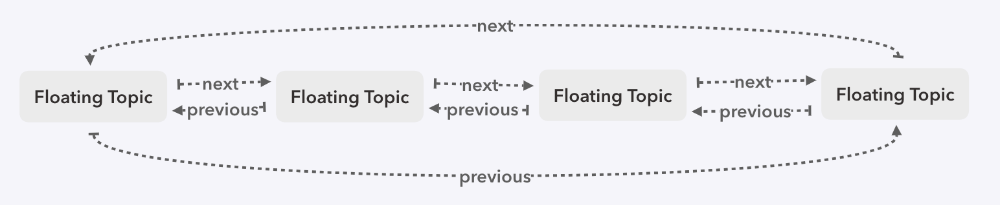

# 源码解析十七 异步渲染

上节说到了我们实现`requestIdleCallback`的`pollfill`，那么它是如何与`schedule`协同到一起的呢？

`react`在`requestIdleCallback`之上，又封装了一个`deferSchedule`，异步调度，都是基于这个模块实现的，它的实现类似于`requestIdleCallback`，暴露了一个启动和取消的函数以及一个是否过期的判断。

先看看启动函数

```javaScript
// 任务节点
export interface CallbackNode {
  previous: CallbackNode,
  next: CallbackNode,
  callback: Function,
  priorityLevel: number,
  expirationTime: number
}

const ImmediatePriority = 1
const IMMEDIATE_PRIORITY_TIMEOUT = -1

const UserBlockingPriority = 2
const USER_BLOCKING_PRIORITY = 250

const NormalPriority = 3
const NORMAL_PRIORITY_TIMEOUT = 5000

const LowPriority = 4
const LOW_PRIORITY_TIMEOUT = 10000

const IdlePriority = 5
const IDLE_PRIORITY = 1073741823

let currentPriorityLevel: number = NormalPriority

function scheduleDeferredCallback(callback: Function, options?: any): CallbackNode {
  const startTime = currentEventStartTime !== -1 ? currentEventStartTime : now()
  let expirationTime: number = 0

  if (isObject(options) && isNumber(options.timeout)) {
    expirationTime = startTime + options.timeout
  } else {
    switch (currentPriorityLevel) {
      case ImmediatePriority:
        expirationTime = startTime + IMMEDIATE_PRIORITY_TIMEOUT
        break
      case UserBlockingPriority:
        expirationTime = startTime + USER_BLOCKING_PRIORITY
        break
      case IdlePriority:
        expirationTime = startTime + IDLE_PRIORITY
        break
      case LowPriority:
        expirationTime = startTime + LOW_PRIORITY_TIMEOUT
        break
      case NormalPriority:
      default:
        expirationTime = startTime + NORMAL_PRIORITY_TIMEOUT
    }
  }

  const newNode: CallbackNode = {
    callback,
    priorityLevel: currentPriorityLevel,
    expirationTime,
    next: null,
    previous: null,
  }

  scheduleCallNode(newNode, expirationTime)
  return newNode
}
```

这里的`expirationTime`已经是转化过的过期时间，单位是`ms`，优先级则采用`priorityLevel`。先计算出当前的`expirationTime`，然后封装成一个任务节点`callBackNode`，随后调用`scheduleCallNode`

### `scheduleCallNode`

在`deferSchedule`中，也维护着一条任务节点的双向环形链表，并且，它是按过期时间从小到大排过序的，它的数据结构类似这样：
                  


scheduleCallNode的目的，就是将新的任务节点，插入到这条链表中，且如果是链表第一个节点，启动整个任务

```javaScript
function scheduleCallNode(newNode: CallbackNode, expirationTime: number) {
  if (firstCallbackNode === null) {
    firstCallbackNode = newNode.next = newNode.previous = newNode
    ensureHostCallbackIsScheduled()
  } else {
    let next: CallbackNode = null
    let node: CallbackNode = firstCallbackNode
    do {
      if (node.expirationTime >= expirationTime) {
        next = node
        break
      }
      node = node.next
    } while (node !== firstCallbackNode)

    if (next === null) {
      // 没有找到比当前callback到期时间大的，将当前callback放到链表最后
      next = firstCallbackNode
    } else if (next === firstCallbackNode) {
      // 当前任务过期时间最小
      firstCallbackNode = newNode
      ensureHostCallbackIsScheduled()
    }

    const previous = next.previous
    previous.next = next.previous = newNode
    newNode.next = next
    newNode.previous = previous
  }
}
```

### `ensureHostCallbackIsScheduled`

```javaScript
let isExecutingCallback: boolean = false // 是否正在工作中的 flag
let isHostCallbackScheduled: boolean = false // 是否初始状态的 flag

function ensureHostCallbackIsScheduled() {
  if (isExecutingCallback) {
    return
  }

  const { expirationTime } = firstCallbackNode
  if (!isHostCallbackScheduled) {
    isHostCallbackScheduled = true
  } else {
    cancelHostCallback()
  }
  requestHostCallback(flushWork, expirationTime)
}
```

接上，整个任务节点的调度，其实都是在这个函数中执行。在看这个函数，主要处理一些与`requestIdleCallback`的交互，取消和开始，核心的处理都在回调函数`flushWork`中

### `flushWork`

每次`requestIdleCallback`触发时，都会调用这个函数，它会遍历`CallbackList`链表，每次从中取出一个`callbackNode`，调用它。这里区分两种情况，过期与非过期

- 过期时，会遍历整个链表，将过期时间小于当前时间的节点都拿出进行调用
- 若在空闲时间内，则调度到空闲时间用完为止

调用完后，在调用`flushImmediateWork`，把需要立即处理的任务从链表中取出来并调用

```javaScript
function flushWork(didTimeout: boolean) {
  isExecutingCallback = true
  const previousDidTimeout = currentDidTimeout
  currentDidTimeout = didTimeout

  try {
    // 处理全部已经过期的callback
    if (didTimeout) {
      while (firstCallbackNode !== null) {
        const currentTime = now()
        if (firstCallbackNode.expirationTime < currentTime) {
          do {
            flushFirstCallback()
          } while (firstCallbackNode !== null && firstCallbackNode.expirationTime <= currentTime)
          continue
        }
        break
      }
    } else {
      // 保持处理直到帧到期
      if (firstCallbackNode !== null) {
        do {
          flushFirstCallback()
        } while (firstCallbackNode !== null && !shouldYieldToHost())
      }
    }
  } finally {
    isExecutingCallback = false
    currentDidTimeout = previousDidTimeout

    // 如果还有任务，继续触发
    if (firstCallbackNode !== null) {
      ensureHostCallbackIsScheduled()
    } else {
      isHostCallbackScheduled = false
    }

    // 处理需要立即执行的任务
    flushImmediateWork()
  }
}

function flushFirstCallback() {
  const flushedNode: CallbackNode = firstCallbackNode

  // 从链表中取出 callbackNode
  let next: CallbackNode = firstCallbackNode.next
  if (firstCallbackNode === next) {
    firstCallbackNode = null
    next = null
  } else {
    const lastCallbackNode: CallbackNode = firstCallbackNode.previous
    firstCallbackNode = lastCallbackNode.next = next
    next.previous = lastCallbackNode
  }
  flushedNode.next = flushedNode.previous = null

  const { callback, expirationTime, priorityLevel } = flushedNode
  const previousPriorityLevel = currentPriorityLevel
  const previousExpirationTime = currentExpirationTime

  currentPriorityLevel = priorityLevel
  currentExpirationTime = expirationTime

  let continuationCallback: any = null

  try {
    continuationCallback = callback(currentDidTimeout)
  } finally {
    currentPriorityLevel = previousPriorityLevel
    currentExpirationTime = previousExpirationTime
  }

  if (isFunction(continuationCallback)) {
    const continuationNode: CallbackNode = {
      callback: continuationCallback,
      priorityLevel,
      expirationTime,
      next: null,
      previous: null,
    }
    scheduleCallNode(continuationNode, expirationTime)
  }
}

function flushImmediateWork() {
  if (currentEventStartTime === -1 && firstCallbackNode !== null && firstCallbackNode.priorityLevel === ImmediatePriority) {
    isExecutingCallback = true

    try {
      do {
        flushFirstCallback()
      } while (firstCallbackNode !== null && firstCallbackNode.priorityLevel === ImmediatePriority)
    } finally {
      isExecutingCallback = false
      if (firstCallbackNode !== null) {
        ensureHostCallbackIsScheduled()
      } else {
        isHostCallbackScheduled = false
      }
    }
  }
}
```

### 与`schedule`的交互

回过头看`schedule`，在`requestWork`中，如果异步会调用`scheduleCallbackWithExpirationTime`

```javaScript
  if (expirationTime === Sync) {
    performSyncWork() // 同步
  } else {
    scheduleCallbackWithExpirationTime(expirationTime) // 异步
  }
```

再看`scheduleCallbackWithExpirationTime`，首先，如果有了一个异步任务，根据其过期时间，判断是否应该取消，随后，将过期时间转化为毫秒形式，传给`scheduleDeferredCallback`，`performAsyncWork`会被封装成`callbackNode`，被`deferSchedule`在空闲时间内调用，看下`performAsyncWork`，如果当前已过期，调用`didExpireAtExpirationTime`，更新优先级大于当前优先级的`FiberRoot`的`nextExpirationTimeToWorkOn`，`nextExpirationTimeToWorkOn`是整个`render`阶段比较优先级的参考值，更新它的话可以保证整个`render`阶段里过期的任务都能准确更新掉

```javaScript
let callbackExpirationTime: ExpirationTime = NoWork // 异步记录时间
let callbackID: CallbackNode // 异步回调对象

function didExpireAtExpirationTime(root: FiberRoot, currentTime: ExpirationTime) {
  const { expirationTime } = root
  if (expirationTime !== NoWork && currentTime <= expirationTime) {
    root.nextExpirationTimeToWorkOn = currentTime
  }
}

function scheduleCallbackWithExpirationTime(expirationTime: ExpirationTime) {
  if (callbackExpirationTime !== NoWork) {
    if (expirationTime < callbackExpirationTime) {
      return
    } else if (callbackID !== null) {
      cancelDeferredCallback(callbackID)
    }
  }

  callbackExpirationTime = expirationTime
  const currentMs = now() - originalStartTimeMs
  const expirationTimeMs = expirationTimeToMS(expirationTime)
  const timeout = expirationTimeMs - currentMs
  callbackID = scheduleDeferredCallback(performAsyncWork, { timeout })
}

function performAsyncWork(didTimeout: boolean) {
  if (didTimeout) {
    // 当前已到期，更新优先级小于当前优先级的 FiberRoot
    if (firstScheduledRoot !== null) {
      recomputeCurrentRendererTime(false)

      let root: FiberRoot = firstScheduledRoot
      do {
        didExpireAtExpirationTime(root, currentRendererTime)
        root = root.nextScheduledRoot
      } while (root !== firstScheduledRoot)
    }
  }
  performWork(NoWork, true)
}

function didExpireAtExpirationTime(root: FiberRoot, currentTime: ExpirationTime) {
  const { expirationTime } = root
  if (expirationTime !== NoWork && currentTime <= expirationTime) {
    root.nextExpirationTimeToWorkOn = currentTime
  }
}
```


