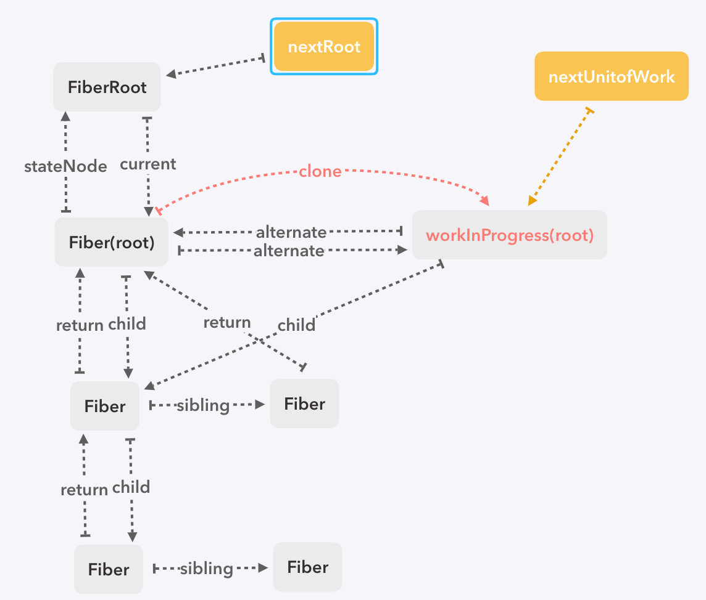
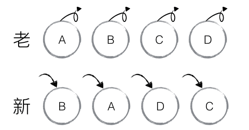

# 源码解析十二 `reconciler childFiber`
在开始这节之前，首先要理清下`ReactElement`和`Fiber`的区别：
- `ReactElement`：通过`createElement()`生成的元素节点，仅包含一些节点的基本信息（props,state）
- `Fiber`：`fiber reconciler`的工作单元，既包含元素节点的基本信息，还要保存一些用于任务调度的信息，以及跟周围节点的关系信息

整个`schedule`系统围绕的核心就是`Fiber`及其他们的关系和调度，所以在拿到`ReactElment`后，都会将其转化为`Fiber`。为了更好的示意，这节的所说的`element`都是指代`ReactElement`，节点都是指`Fiber`节点

整棵`workInProgress`树，都是从`current`树复制过来的，所以在没有调和子节点前，当前工作的`workInProgress`的`child`指向`current`，如图：


因为`element`上的属性`Fiber`上都有，所以，我们可以拿新的`element`跟当前对应的`current Fiber`进行比较，通过新的`element`以及`current`，生成子`workInprogress`，`reconciler childFiber`做的就是这些。注意，这里只是调和生成子节点的过程，更新节点的内容还得等`nextUnitOfWork`指向它，然后调用`beginWork`和`completeUnitOfWork`更新

### `reconcileChildren`
`begeinwork`，每种类型的调和函数在更新自身的属性时，也会更新其`element`，如：
- functionComponent：直接执行，生成新`element`
- classComponent：调用实例的`render()`，生成新`element`
- hostComponent：`props.children`
每个函数的最后一步，就是将新的`element`传入`reconcileChildren`，生成新的子节点

```javaScript
const mountChildFibers = ChildReconciler(false)
const reconcileChildFibers = ChildReconciler(true)

/**
 * @param current 当前 current 父节点
 * @param workInProgress  workInProgress 父节点
 * @param nextChildren  新的 element
 * @param renderExpirationTime 当前优先级
 */
function reconcileChildren(current: Fiber, workInProgress: Fiber, nextChildren: any, renderExpirationTime: ExpirationTime) {
  // 新渲染
  if (current === null) {
    workInProgress.child = mountChildFibers(workInProgress, null, nextChildren, renderExpirationTime)
  // 更新 current.child 是当前current子节点
  } else {
    workInProgress.child = reconcileChildFibers(workInProgress, current.child, nextChildren, renderExpirationTime)
  }
}
```

如果`current`没有，说明新的`element`需要渲染。反之，则是更新，`current.child`是要做比较的对象，可以称其为旧节点。这里的核心在于`ChildReconciler`，这是个采用闭包封装的模块，里面包含了各种类型的子节点的调和方法

```javaScript
function ChildReconciler(shouldTrackSideEffects: boolean) {
  function deleteChild(returnFiber: Fiber, childToDelete: Fiber) {
    ...
  }

  function deleteRemainingChildren(returnFiber: Fiber, currentFirstChild: Fiber) {
    ...
  }

  function placeChild(newFiber: Fiber, lastPlacedIndex: number, newIdx: number): number {
    ...
  }


  function placeSingleChild(newFiber: Fiber): Fiber {
    ...
  }

  function createChild(returnFiber: Fiber, newChild: any, expirationTime: ExpirationTime): Fiber {
    ...
  }

  function updateFragment(returnFiber: Fiber, current: Fiber, fragment: any, expirationTime: ExpirationTime, key: string | null): Fiber {
    ...
  }

  function updateTextNode(returnFiber: Fiber, current: Fiber, textContent: string, expirationTime: ExpirationTime): Fiber {
    ...
  }

  function updateElement(returnFiber: Fiber, current: Fiber, element: ReactElement, expirationTime: ExpirationTime): Fiber {
    ...
  }

  function updatePortal(returnFiber: Fiber, current: Fiber, portal: ReactPortal, expirationTime: ExpirationTime): Fiber {
    ...
  }

  function updateFromMap(returnFiber: Fiber, existingChildren: Map<string | number, Fiber>, newChild: any, newIdx: number, expirationTime: ExpirationTime) {
    ...
  }

  function updateSlot(returnFiber: Fiber, oldFiber: Fiber, newChild: any, expirationTime: ExpirationTime) {
    ...
  }

  function reconcileSingleElement(returnFiber: Fiber, currentFirstChild: Fiber, element: ReactElement, expirationTime: ExpirationTime): Fiber {
    ...
  }

  function reconcileSinglePortal(returnFiber: Fiber, currentFirstChild: Fiber, portal: any, expirationTime: ExpirationTime): Fiber {
    ...
  }

  function reconcileSingleTextNode(returnFiber: Fiber, currentFirstChild: Fiber, textContent: string, expirationTime: ExpirationTime): Fiber {
    ...
  }

  function reconcileChildrenArray(returnFiber: Fiber, currentFirstChild: Fiber, newChildren: any[], expirationTime: ExpirationTime): Fiber {
    ...
 }

  return (returnFiber: Fiber, currentFirstChild: Fiber, newChild: any, expirationTime: ExpirationTime): Fiber => {
    // 处理fragment
    const isUnkeyedTopLevelFragment = isObject(newChild) && newChild.type === REACT_FRAGMENT_TYPE && newChild.key === null
    if (isUnkeyedTopLevelFragment) {
      newChild = newChild.props.children
    }

    if (isObject(newChild)) {
      switch (newChild.$$typeof) {
        case REACT_ELEMENT_TYPE:
          return placeSingleChild(reconcileSingleElement(returnFiber, currentFirstChild, newChild, expirationTime))
        case REACT_PORTAL_TYPE:
          return placeSingleChild(reconcileSinglePortal(returnFiber, currentFirstChild, newChild, expirationTime))
      }
    }

    if (isText(newChild)) {
      return placeSingleChild(reconcileSingleTextNode(returnFiber, currentFirstChild, newChild, expirationTime))
    }

    if (isArray(newChild)) {
      return reconcileChildrenArray(returnFiber, currentFirstChild, newChild, expirationTime)
    }

    if (typeof newChild === 'undefined' && !isUnkeyedTopLevelFragment) {
      if (returnFiber.tag === ClassComponent) {
        console.error('render必须返回内容')
      }
    }

    return deleteRemainingChildren(returnFiber, currentFirstChild)
  }
}
```

整个模块的入口，主要区分了几种类型，嗯，也就是允许我们在JSX中写的那几种子类型：
- 单个`react element`
- 单个`portal element`
- 文本
- 数组

不管是哪种类型，都会删除无用的节点，所以，先看删除节点的函数：
```javaScript
  // 单个删除
  function deleteChild(returnFiber: Fiber, childToDelete: Fiber) {
    if (!shouldTrackSideEffects) {
      return
    }

    // 清除 effect fiber
    const last = returnFiber.lastEffect
    if (last !== null) {
      last.nextEffect = childToDelete
      returnFiber.lastEffect = childToDelete
    } else {
      returnFiber.firstEffect = returnFiber.lastEffect = childToDelete
    }
    childToDelete.nextEffect = null

    // 挂上删除的标识
    childToDelete.effectTag = Deletion
  }

  // 批量删除
  function deleteRemainingChildren(returnFiber: Fiber, currentFirstChild: Fiber) {
    if (!shouldTrackSideEffects) {
      return null
    }

    let childToDelete: Fiber = currentFirstChild
    while (childToDelete !== null) {
      deleteChild(returnFiber, childToDelete)
      childToDelete = childToDelete.sibling
    }

    return null
  }
```

### 单个节点
```javaScript
placeSingleChild(reconcileSingleElement(returnFiber, currentFirstChild, newChild, expirationTime))
```
单个节点的处理比较简单
- 拿新旧节点作比较，如果key跟type都相等，就直接复用之前的`fiber`。反正，就创建一个新的`fiber`，effectTag挂上'placement'，说明是个放置的节点，(`fragment`判断新旧是否都是`fragment`，`portal`判断`containerInfo`)
- 删除多余节点

```javaScript
// 复用老 Fiber
function useFiber(fiber: Fiber, pendingProps: any): Fiber {
  const clone = createWorkInProgress(fiber, pendingProps)

  clone.index = 0
  clone.sibling = null
  return clone
}

  function placeSingleChild(newFiber: Fiber): Fiber {
    // 更新且是新增节点，打上标
    if (shouldTrackSideEffects && newFiber.alternate === null) {
      newFiber.effectTag = Placement
    }
    return newFiber
  }

  function reconcileSingleElement(returnFiber: Fiber, currentFirstChild: Fiber, element: ReactElement, expirationTime: ExpirationTime): Fiber {
    let child: Fiber = currentFirstChild

    while (child != null) {
      if (child.key === element.key) {
        if (child.tag === Fragment ? element.type === REACT_FRAGMENT_TYPE : child.elementType === element.type) {
          deleteRemainingChildren(returnFiber, child.sibling)

          const existing = useFiber(child, element.type === REACT_FRAGMENT_TYPE ? element.props.children : element.props)
          existing.ref = element.ref
          existing.return = returnFiber

          return existing
        } else {
          deleteRemainingChildren(returnFiber, child)
          break
        }
      } else {
        deleteChild(returnFiber, child)
      }

      child = child.sibling
    }

    const created = createFiberFromElement(element, returnFiber.mode, expirationTime)
    created.ref = element.ref
    created.return = returnFiber

    return created
  }
```

### 文本
文本的处理类似于单个节点，如果旧节点也是文本节点，直接复用之前的`fiber`，反正创建新节点，当然，别忘记删除多余节点

```javaScript
  function reconcileSingleTextNode(returnFiber: Fiber, currentFirstChild: Fiber, textContent: string, expirationTime: ExpirationTime): Fiber {
    if (currentFirstChild !== null && currentFirstChild.tag === HostText) {
      deleteRemainingChildren(returnFiber, currentFirstChild.sibling)

      const existing = useFiber(currentFirstChild, textContent)
      existing.return = returnFiber

      return existing
    }

    deleteRemainingChildren(returnFiber, currentFirstChild)
    const created = createFiberFromText(textContent, returnFiber.mode, expirationTime)
    created.return = returnFiber

    return created
  }
```

### 数组
数组的处理则相对复杂了很多，整个`reconcileChildrenArray`里有好几个大循环，我们一个一个解析

```javaScript
  function reconcileChildrenArray(returnFiber: Fiber, currentFirstChild: Fiber, newChildren: any[], expirationTime: ExpirationTime): Fiber {
    let resultingFirstChild: Fiber = null // 要返回的子 Fiber 链表头
    let previousNewFiber: Fiber = null // 当前的链表尾部

    let oldFiber: Fiber = currentFirstChild
    let lastPlacedIndex: number = 0

    let newIdx: number = 0
    let nextOldFiber: Fiber = null

    for (; oldFiber !== null && newIdx < newChildren.length; newIdx++) {
      if (oldFiber.index > newIdx) {
        nextOldFiber = oldFiber
        oldFiber = null
      } else {
        nextOldFiber = oldFiber.sibling
      }

      // 比较节点
      const newFiber = updateSlot(returnFiber, oldFiber, newChildren[newIdx], expirationTime)

      if (newFiber === null) { // 新旧key不相同，直接退出循环
        if (oldFiber === null) {
          oldFiber = nextOldFiber
        }
        break
      }

      // 删除多余的老节点
      if (shouldTrackSideEffects && (oldFiber && newFiber.alternate === null)) {
        deleteChild(returnFiber, oldFiber)
      }

      lastPlacedIndex = placeChild(newFiber, lastPlacedIndex, newIdx)

      if (previousNewFiber === null) {
        resultingFirstChild = newFiber
      } else {
        previousNewFiber.sibling = newFiber
      }
      previousNewFiber = newFiber

      oldFiber = nextOldFiber
    }
```

第一个循环相当于一个预处理，每个`Fiber`都有一个`index`，类似于数组的索引值。

看循环里面，首先是个判断，确保每一个新节点都有相应`index`的老节点可以进行比较（新节点是`element`，老节点是`Fiber`）。随后调用`updateSlot`比较新老节点，如果`key`相同，返回新的`Fiber`，不相同的话，直接返回null，退出第一个循环。此时就找到了第一个与新节点key不相等的旧节点，挂在oldFiber上

看下`updateSlot`：

```javaScript
  function updateSlot(returnFiber: Fiber, oldFiber: Fiber, newChild: any, expirationTime: ExpirationTime) {
    const key = oldFiber !== null ? oldFiber.key : null

    if (isText(newChild)) {
      if (key !== null) {
        return null
      }

      return updateTextNode(returnFiber, oldFiber, '' + newChild, expirationTime)
    }

    if (isObject(newChild)) {
      switch (newChild.$$typeof) {
        case REACT_ELEMENT_TYPE:
          if (newChild.key === key) {
            if (newChild.type === REACT_FRAGMENT_TYPE) {
              return updateFragment(returnFiber, oldFiber, newChild.props.children, expirationTime, key)
            }

            return updateElement(returnFiber, oldFiber, newChild, expirationTime)
          } else {
            return null
          }
        case REACT_PORTAL_TYPE:
          if (newChild.key === key) {
            return updatePortal(returnFiber, oldFiber, newChild, expirationTime)
          } else {
            return null
          }
      }
    }

    if (isArray(newChild)) {
      if (key !== null) {
        return null
      }

      return updateFragment(returnFiber, oldFiber, newChild, expirationTime, null)
    }

    return null
  }
```

对于每一种类型，首先比较`key`是否相等，不相等直接返回`null`，相等的话，在调用`update`函数，每个`update`的逻辑都差不多，这里拿`updateElement`举个例子，这里很简单，如果类型相同，复用老的`Fiber`，不相同的话，则用新的`element`创建一个`Fiber`：

```javaScript
  function updateElement(returnFiber: Fiber, current: Fiber, element: ReactElement, expirationTime: ExpirationTime): Fiber {
    let fiber: Fiber = null
    if (current === null || current.elementType !== element.type) {
      fiber = createFiberFromElement(element, returnFiber.mode, expirationTime)
    } else {
      fiber = useFiber(current, element.props)
    }

    fiber.ref = element.ref
    fiber.return = returnFiber
    return fiber
  }
```

结束完第一个循环后，如果`newIdx === newChildren.length`，说明新的数组也已遍历完，老节点链表里还有没比较过的，全部删掉

```javaScript
    // 新的数组已全部遍历完，删除余下的旧元素，返回
    if (newIdx === newChildren.length) { 
      deleteRemainingChildren(returnFiber, oldFiber)
      return resultingFirstChild
    }

```

继续往下，如果`oldFiber === null`，说明老的链表已经全部遍历完，若新的数组还有没比较的，那么这些都是新增的，处理下

```javaScript
    if (oldFiber === null) { // 旧的遍历完，新的还有，说明后续的都是新增
      for (; newIdx < newChildren.length; newIdx++) {
        const newFiber = createChild(returnFiber, newChildren[newIdx], expirationTime)
        if (!newFiber) {
          continue
        }

        lastPlacedIndex = placeChild(newFiber, lastPlacedIndex, newIdx)

        if (previousNewFiber === null) {
          resultingFirstChild = newFiber
        } else {
          previousNewFiber.sibling = newFiber
        }
        previousNewFiber = newFiber
      }
      return resultingFirstChild
    }
```

最后，如果新老都还有，有可能是顺序换了，或者新增，或者删减。这种情况下，先把剩下的老节点链表转为`map`，若有`key`则取`key`，无`key`则取`index`
```javaScript
const existingChildren = mapRemainingChildren(oldFiber)

function mapRemainingChildren(currentFirstChild: Fiber): Map<string | number, Fiber> {
  const existingChildren: Map<string | number, Fiber> = new Map()

  let existingChild: Fiber = currentFirstChild
  while (existingChild !== null) {
    if (existingChild.key !== null) {
      existingChildren.set(existingChild.key, existingChild)
    } else {
      existingChildren.set(existingChild.index, existingChild)
    }
    existingChild = existingChild.sibling
  }
  return existingChildren
}    
```

获取老节点的`map`后，遍历余下的新节点数组，使用`updateFromMap`对比新老节点，并返回新的`Fiber`，若有`key`，则通过`key`从`map`中拿到需要对比的节点，反之，则使用`index`，这与转换`map`时的逻辑相同，由于文本和数组是没有Key的，所以这两种情况下直接用`index`取：

```javaScript
  function updateFromMap(returnFiber: Fiber, existingChildren: Map<string | number, Fiber>, newChild: any, newIdx: number, expirationTime: ExpirationTime) {
    let matchedFiber = existingChildren.get(newChild.key === null ? newIdx : newChild.key) || null

    if (isText(newChild)) {
      matchedFiber = existingChildren.get(newIdx) || null
      return updateTextNode(returnFiber, matchedFiber, '' + newChild, expirationTime)
    }

    if (isObject(newChild)) {
      switch (newChild.$$typeof) {
        case REACT_ELEMENT_TYPE: {
          if (newChild.type === REACT_FRAGMENT_TYPE) {
            return updateFragment(returnFiber, matchedFiber, newChild.props.children, expirationTime, newChild.key)
          }
          return updateElement(returnFiber, matchedFiber, newChild, expirationTime)
        }
        case REACT_PORTAL_TYPE: {
          return updatePortal(returnFiber, matchedFiber, newChild, expirationTime)
        }
      }

      if (isArray(newChild)) {
        matchedFiber = existingChildren.get(newIdx) || null
        return updateFragment(returnFiber, matchedFiber, newChild, expirationTime, null)
      }
    }
    return null
  }
```

再回到上面：

```javaScript
    for (; newIdx < newChildren.length; newIdx++) {
      const newFiber = updateFromMap(returnFiber, existingChildren, newChildren[newIdx], newIdx, expirationTime)

      if (newFiber) {
        if (shouldTrackSideEffects) {
          // 将比较过的节点从集合中去掉
          if (newFiber.alternate !== null) {
            existingChildren.delete(newFiber.key === null ? newIdx : newFiber.key)
          }
        }

        lastPlacedIndex = placeChild(newFiber, lastPlacedIndex, newIdx)

        if (previousNewFiber === null) {
          resultingFirstChild = newFiber
        } else {
          previousNewFiber.sibling = newFiber
        }
        previousNewFiber = newFiber
      }
    }

    if (shouldTrackSideEffects) {
      // 余下集合里的节点说明都是多余，直接删除
      existingChildren.forEach((child: Fiber) => deleteChild(returnFiber, child))
    }
    return resultingFirstChild
  }
```

拿到新的`Fiber`以后，都会有`lastPlacedIndex = placeChild(newFiber, lastPlacedIndex, newIdx)`，在这个函数里，有我们熟悉的`lastIndex`优化，`lastPlaceIndex`保留着当前访问过的老节点中最右的索引值，如果某个新节点有对应的老节点，先拿到老节点的`index`，如果`index`大于`lastPlaeIndex`，说明这个老节点在老的链表中就在当前访问过的最右节点之后，所以，可以直接复用，无需插入，举个例子，如下图：



- 第一次进`placeChild`，此时的`lastPlacedIndex`是0，newFiber = B，能获取到老节点，说明是更新，老节点的索引值为1，大于0，所以B节点无需移动，直接拉下来复用，更新`lastPlaceIndex`为1
- 第二次进`placeChild`，此时的`lastPlacedIndex`是1，newFiber = A，能获取到老节点，老节点的索引值为0，小于1，所以是个需要更新的节点，打上`Placement`
- 第三次进`placeChild`，此时的`lastPlacedIndex`还是1，newFiber = D，能获取到老节点，老节点的索引值为3，大于1，所以D节点在之前访问过的任意老节点后面，所以直接拉下来复用，并且更新`lastPlaceIndex`为3
- 第四次进`placeChild`，此时的`lastPlacedIndex`是3，newFiber = C，能获取到老节点，老节点的索引值为2，小于1，所以是个需要更新的节点，打上`Placement`

```javaScript
  function placeChild(newFiber: Fiber, lastPlacedIndex: number, newIdx: number): number {
    newFiber.index = newIdx

    if (!shouldTrackSideEffects) {
      return lastPlacedIndex
    }

    const current = newFiber.alternate
    // 更新
    if (current !== null) {
      const oldIndex = current.index
      if (oldIndex < lastPlacedIndex) {
        newFiber.effectTag = Placement // 需要插入
        return lastPlacedIndex
      } else {
        return oldIndex
      }
    // 移动
    } else {
      newFiber.effectTag = Placement
      return lastPlacedIndex
    }
  }
```

打上标记后，对于新的`Fiber`节点，由于是同一层级，所以还要连成链表，整个数组的方法里有两个变量，记录着新链表的表头和当前的链表尾，所以我们要做的就是没有链表先创建，有链表就直接接进去：

```javaScript
    let resultingFirstChild: Fiber = null // 要返回的子 Fiber 链表头
    let previousNewFiber: Fiber = null // 当前的链表尾部

    if (previousNewFiber === null) {
      resultingFirstChild = newFiber
    } else {
      previousNewFiber.sibling = newFiber
    }
    previousNewFiber = newFiber
```

以上就是整个数组部分的`reconciler childFiber`，可见，`key`在整个数组的调和中里发挥着巨大的作用。它是节点的唯一标识，可以快速定位到原来节点，方便判断是更新还是添加，如果没有`key`，可能会多很多多余的删除和新建，开销巨大


