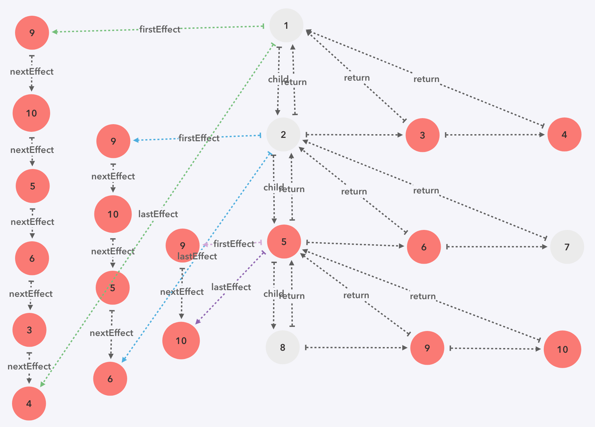

# 源码解析十三 `completeUnitOfWork`
在前面的`beginWork`中，更新的时候`effectTag`设为`Update`，删除的时候设为`Deletion`，移动添加时设为`Placement`，`React`中在这些状态的设计上采用了二进制，这样子做有利于简化类型比较、类型复合、控制类型优先级等，可以说非常的巧妙了：

```javaScript
export type SideEffectTag = number

export const NoEffect = /*              */ 0b000000000000
export const PerformedWork = /*         */ 0b000000000001

export const Placement = /*             */ 0b000000000010
export const Update = /*                */ 0b000000000100
export const PlacementAndUpdate = /*    */ 0b000000000110
export const Deletion = /*              */ 0b000000001000
export const ContentReset = /*          */ 0b000000010000
export const Callback = /*              */ 0b000000100000
export const DidCapture = /*            */ 0b000001000000
export const Ref = /*                   */ 0b000010000000
export const Snapshot = /*              */ 0b000100000000
export const Passive = /*               */ 0b001000000000

export const LifecycleEffectMask = /*   */ 0b001110100100

export const HostEffectMask = /*        */ 0b001111111111

export const Incomplete = /*            */ 0b010000000000
export const ShouldCapture = /*         */ 0b100000000000
```

回到正题，上节说到，每一个节点都会走一遍`beginWork`和`completeUnitOfWork`，所以这节主要讲下`completeUnitOfWork`，以下是源码：

```javaScript
function completeUnitOfWork(workInProgress: Fiber): Fiber {
  while (true) {
    const current = workInProgress.alternate
    const returnFiber = workInProgress.return
    const siblingFiber = workInProgress.sibling

    if ((workInProgress.effectTag & Incomplete) === NoEffect) {
      nextUnitOfWork = completeWork(current, workInProgress)
      updateChildExpirationTime(workInProgress, nextRenderExpirationTime)

      if (nextUnitOfWork !== null) {
        return nextUnitOfWork
      }

      // 将需要 commit 的 Fiber 集成链表放在当前 Fiber 的 firstEffect 上
      if (returnFiber !== null && (returnFiber.effectTag & Incomplete) === NoEffect) {
        if (returnFiber.firstEffect === null) {
          returnFiber.firstEffect = workInProgress.firstEffect
        }

        if (workInProgress.lastEffect !== null) {
          if (returnFiber.lastEffect !== null) {
            returnFiber.lastEffect.nextEffect = workInProgress.firstEffect
          }
          returnFiber.lastEffect = workInProgress.lastEffect
        }

        const { effectTag } = workInProgress
        if (effectTag > PerformedWork) {
          if (returnFiber.lastEffect !== null) {
            returnFiber.lastEffect.nextEffect = workInProgress
          } else {
            returnFiber.firstEffect = workInProgress
          }
          returnFiber.lastEffect = workInProgress
        }
      }
    } else {
      const next = unwindWork(workInProgress, nextRenderExpirationTime)

      if (next !== null) {
        next.effectTag &= HostEffectMask
        return next
      }

      if (returnFiber !== null) {
        returnFiber.firstEffect = returnFiber.lastEffect = null
        returnFiber.effectTag |= Incomplete
      }
    }

    if (siblingFiber !== null) {
      return siblingFiber
    } else if (returnFiber !== null) {
      workInProgress = returnFiber
      continue
    } else {
      return null
    }
  }
}
```

先调一遍`completeWork`，这个函数后面会详细讲，继续往下走，调了`updateChildExpirationTime`，这个函数对当前节点的子节点做了遍历，根据子节点的`expirationTime`和`childExpirationTime`更新当前节点的`childExpirationTime`

```javaScript
// 更新当前节点的 childExpirationTime
function updateChildExpirationTime(workInProgress: Fiber, renderTime: ExpirationTime) {
  if (renderTime !== Never && workInProgress.childExpirationTime === Never) { // 子节点hidden的，直接跳过
    return
  }
  let newChildExpiration: ExpirationTime = NoWork
  let child: Fiber = workInProgress.child

  while (child !== null) {
    const childUpdateExpirationTime = child.expirationTime
    const childChildExpirationTime = child.childExpirationTime

    if (childUpdateExpirationTime > newChildExpiration) {
      newChildExpiration = childUpdateExpirationTime
    }

    if (childChildExpirationTime > newChildExpiration) {
      newChildExpiration = childChildExpirationTime
    }
    child = child.sibling
  }
  workInProgress.childExpirationTime = newChildExpiration
}
```

在后面部分是对`effect`的一个处理，先理一下`effect`的概念，每个`Fiber`上都有`firstEffect`和`lastEffect`，类似于schedule中的`FiberRoot`链表。它记录着一条`effectTag`大于`performedWork`的`Fiber`链表。如下图

```            
            nextEffect        nextEffect        nextEffect
firstEffect ----------> Fiber ----------> Fiber ----------> lastFiberRoot
```

```javaScript
// 将需要 commit 的 fiber 集成链表放在当前 fiber 的 firstEffect 上
      if (returnFiber !== null && (returnFiber.effectTag & Incomplete) === NoEffect) {
        if (returnFiber.firstEffect === null) {
          returnFiber.firstEffect = workInProgress.firstEffect
        }

        if (workInProgress.lastEffect !== null) {
          if (returnFiber.lastEffect !== null) {
            returnFiber.lastEffect.nextEffect = workInProgress.firstEffect
          }
          returnFiber.lastEffect = workInProgress.lastEffect
        }

        const { effectTag } = workInProgress
        if (effectTag > PerformedWork) {
          if (returnFiber.lastEffect !== null) {
            returnFiber.lastEffect.nextEffect = workInProgress
          } else {
            returnFiber.firstEffect = workInProgress
          }
          returnFiber.lastEffect = workInProgress
        }
      }
```

`beginwork`和`completeWork`中会根据节点的更新状态打上不同的`effectTag`，然后在`completeUnitOfWork`，会将自身的`effect`链表挂在父节点上。最终，在根节点上会挂有一条该树下全部`effectTag`大于`performedWork`的链表，`commit`的时候就是遍历`effect`链表，根据每种`effect`的类型更新dom



最后，由于`beginWork`会一直往下走，为了保证每层的兄弟节点执行到`beginWork`和`completeUnitOfWork`，在`completeUnitOfWork`中，如果`siblingFiber`有，就返回`siblingFiber`。如果有父节点，因为父节点只执行了`beginWork`，所以需要`continue`，让其执行一次`completeWork`

```javaScript
    if (siblingFiber !== null) {
      return siblingFiber
    } else if (returnFiber !== null) {
      workInProgress = returnFiber
      continue
    } else {
      return null
    }
```


