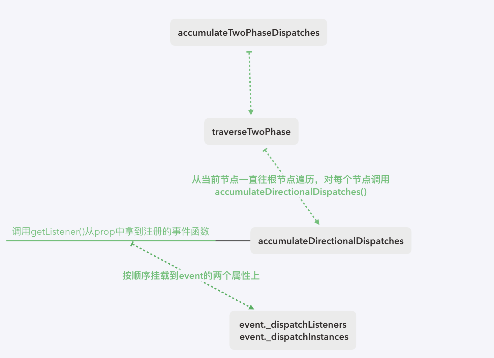

# 事件触发

上节说到，会把 `dispatch()`绑定到原生`DOM`上，每次触发事件时，调用的都是`dispatch`函数

### `dispatch`
```javascript
function dispatchEvent(topLevelType: TopLevelType, nativeEvent: AnyNativeEvent) {
  if (!_enabled) {
    return
  }

  const nativeEventTarget = getEventTarget(nativeEvent)
  let targetInst: Fiber = getClosestInstanceFromNode(nativeEventTarget)

  if (targetInst !== null && isNumber(targetInst.tag) && !isFiberMounted(targetInst)) {
    targetInst = null
  }

  const bookKeeping = getTopLevelCallbackBookKeeping(topLevelType, nativeEvent, targetInst)

  try {
    batchedUpdates(handleTopLevel, bookKeeping)
  } catch (e) {
    console.error(e)
    releaseTopLevelCallbackBookKeeping(bookKeeping)
  }
}
```

先通过`event`对象拿到`target`和相应的`fiber`实例，然后封装成一个`bookKeeping`对象，这里同样使用了对象池来优化创建的过程，在`getTopLevelCallbackBookKeeping`中根据对象池的大小取出或者新建对象，在事件完成后使用`releaseTopLevelCallbackBookKeeping`释放对象并放回到事件池中

关键在于这里的`batchedUpdates`，这个函数位于`schedule`中，是`react`里实现异步`setState`的核心所在。在执行事件前，将`isBatchingUpdates`这个标志位设为了true。这个标志位在`requestWork`中有用到

```javascript
function requestWork(root: FiberRoot, expirationTime: ExpirationTime) {
  addRootToSchedule(root, expirationTime)
  if (isRendering) {
    return
  }

  if (isBatchingUpdates) {
    if (isUnbatchingUpdates) {
      nextFlushedRoot = root
      nextFlushedExpirationTime = Sync
      performWorkOnRoot(root, Sync, false)
    }
    return
  }

  if (expirationTime === Sync) {
    performSyncWork() // 同步
  } else {
    scheduleCallbackWithExpirationTime(expirationTime) // 异步
  }
}
```

回顾`requestWork`，如果`isBatchingUptes`为`true`的话，就直接中断掉，不往下继续执行。所以渲染在事件函数没执行完之前都不会进行，一直到整个事件函数都结束掉，在`finally`中重启整个任务，所以如果在同一个事件监听函数中多次`setState`，则只是将它们放到`updateQueue`的末尾。`React`通过这个异步机制避免了频繁`setState`触发渲染造成的性能浪费

```javascript
function batchedUpdates<A, R>(fn: (a: A) => R, a: A): R {
  const previousIsBatchingUpdates = isBatchingUpdates
  isBatchingUpdates = true

  try {
    return fn(a)
  } finally {
    isBatchingUpdates = previousIsBatchingUpdates
    if (!isBatchingUpdates && !isRendering) {
      performSyncWork()
    }
  }
}
```

### handleTopLevel 
由于事件函数中可能会操作`DOM`，导致与初始渲染时的节点缓存不一致，所以在进入核心逻辑之前，先构建一个关于`ancestor`数组，防止任何的嵌套组件导致的`bug`。构建完`ancestor`数组后，我们可以利用现有的信息去生成`event`

```javascript
function handleTopLevel(bookKeeping: BookKeeping) {
  let targetInst: Fiber = bookKeeping.targetInst
  let ancestor: Fiber = targetInst

  do {
    if (!ancestor) {
      bookKeeping.ancestors.push(ancestor)
      break
    }

    const root = findRootContainerNode(ancestor)

    if (!root) {
      break
    }

    bookKeeping.ancestors.push(ancestor)
    ancestor = getClosestInstanceFromNode(root)
  } while (ancestor)

  bookKeeping.ancestors.forEach((target: Fiber) => {
    targetInst = target

    runExtractedEventsInBatch(bookKeeping.topLevelType, targetInst, bookKeeping.nativeEvent, getEventTarget(bookKeeping.nativeEvent))
  })
}
```

### 获取`SyntheticEvent`
前面介绍`plugin`时提到过，每个`plugin`都有着统一的`extractEvents`函数，用于生成`SyntheticEvent`

整个获取`SyntheticEvent`的过程也就是遍历已经`inject`的`plugin`，调用它们各自的`extractEvents`拿到`SyntheticEvent`，那么，`extractEvents`是如何生成`event`的呢？具体的逻辑如下：
- 通过传入的事件名，选择对应的具体的`SyntheticEvent`子类，如`touch`事件对应的`SyntheticEvent`是`SyntheticTouchEvent`
- 通过事件池拿到`event`对象
- 模拟冒泡、捕获的过程，按照顺序取出`props`的事件监听函数，绑定到`event`的属性上
- 返回`event`

### 冒泡、捕获处理
在获得`SyntheticEvent`的过程中，`plugin`的`extractEvents`都调用了`accumulateTwoPhaseDispatches`对冒泡、捕获做了处理，如图



```javascript
function accumulateTwoPhaseDispatches(events: SyntheticEvent) {
  function callback(event: SyntheticEvent) {
    if (event && event.dispatchConfig.phasedRegistrationNames) {
      traverseTwoPhase(event._targetInst, accumulateDirectionalDispatches, event) // 捕获和冒泡
    }
  }

  forEachAccumulated(events, callback)
}

export function traverseTwoPhase(inst: Fiber, fn: Function, arg: SyntheticEvent) {
  const path = []
  while (inst) {
    path.push(inst)
    inst = getParent(inst)
  }

  let i: number
  for (i = path.length; i-- > 0;) {
    fn(path[i], 'captured', arg)
  }
  for (i = 0; i < path.length; i++) {
    fn(path[i], 'bubbled', arg)
  }
}
```

在`traverseTwoPhase`中对当前`fiber`往上遍历直到`fiberRoot`，并存储到`path`中，之后按照 捕获->冒泡 的顺序对每个`path`的`fiber`调用`accumulateDirectionalDispatches`

```javascript
function accumulateDirectionalDispatches(inst: Fiber, phase: Phases, event: SyntheticEvent) {
  const listener = listenAtPhase(inst, event, phase)

  if (listener) {
    event._dispatchListeners = accumulateInto(event._dispatchListeners, listener)
    event._dispatchInstances = accumulateInto(event._dispatchInstances, inst)
  }
}
```

在这个函数中，根据传入的参数，拿到`fiber props`的事件处理函数和相应的`fiber`，并挂载到`event`的`_dispatchListeners`和`_dispatchInstances`上

```javascript
function getListener(inst: Fiber, registrationName: string): Function {
  let listener: Function = null

  const { stateNode } = inst
  if (!stateNode) {
    return null
  }

  const props = getFiberCurrentPropsFromNode(stateNode)
  if (!props) {
    return null
  }

  listener = props[registrationName]

  if (shouldPreventMouseEvent(registrationName, inst.type, props)) {
    return null
  }

  return listener
}

function listenAtPhase(inst: Fiber, event: SyntheticEvent, phase: Phases) {
  const registrationName = event.dispatchConfig.phasedRegistrationNames[phase]
  return getListener(inst, registrationName)
}
```

### 执行事件函数
由于在生成`event`时已经把`props`里跟事件有关的信息注册到`event`的`_dispatchListeners`和`_dispatchInstances`上，所以，我们需要遍历`_dispatchListeners`，执行相应的事件函数`listener(event)`，由于这里是直接执行，所以在我们写的事件函数中，如果使用了`this`切没有强绑定上，在调用时会拿不到相应`this`，到这里，整个事件的触发过程就结束了，回到`batchedUpdates`的`finally`，把相应的标记位置回`false`，并且重新触发渲染

```javascript
function executeDispatchesInOrder(event: SyntheticEvent) {
  const dispatchListeners = event._dispatchListeners
  const dispatchInstances = event._dispatchInstances

  if (Array.isArray(dispatchListeners)) {
    for (let i = 0; i < dispatchListeners.length; i++) {
      // 判断是否停止冒泡
      if (event.isPropagationStopped()) {
        break
      }

      executeDispatch(event, dispatchListeners[i], dispatchInstances[i])
    }
  } else if (dispatchListeners) {
    executeDispatch(event, dispatchListeners, dispatchInstances as Fiber)
  }
  event._dispatchListeners = null
  event._dispatchInstances = null
}

function executeDispatch(event: SyntheticEvent, listener: Function, inst: Fiber) {
  event.currentTarget = getNodeFromInstance(inst)
  listener(event)
  event.currentTarget = null
}

export {
  executeDispatchesInOrder,
}
```


