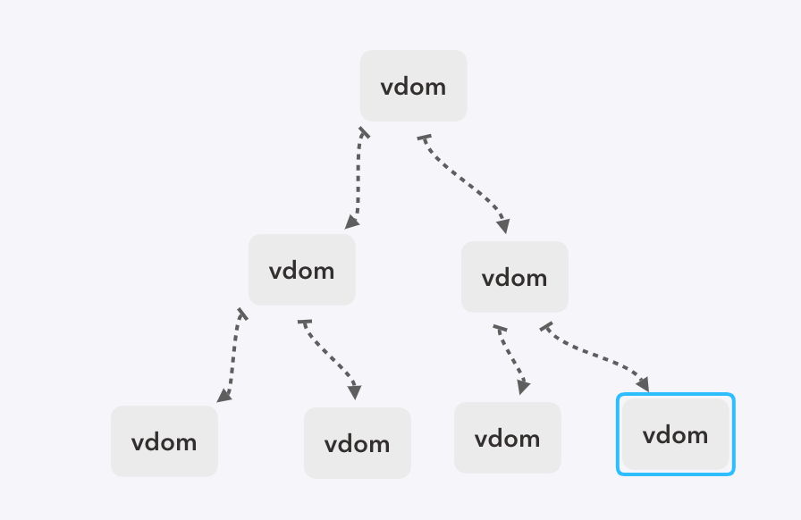
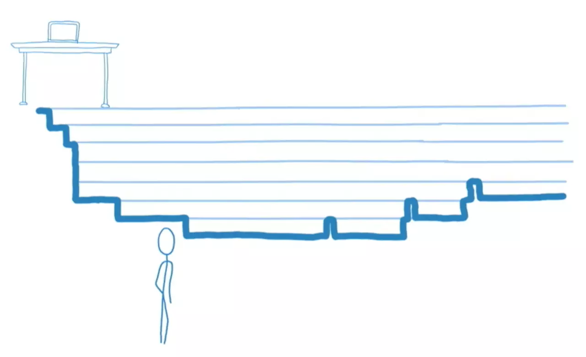
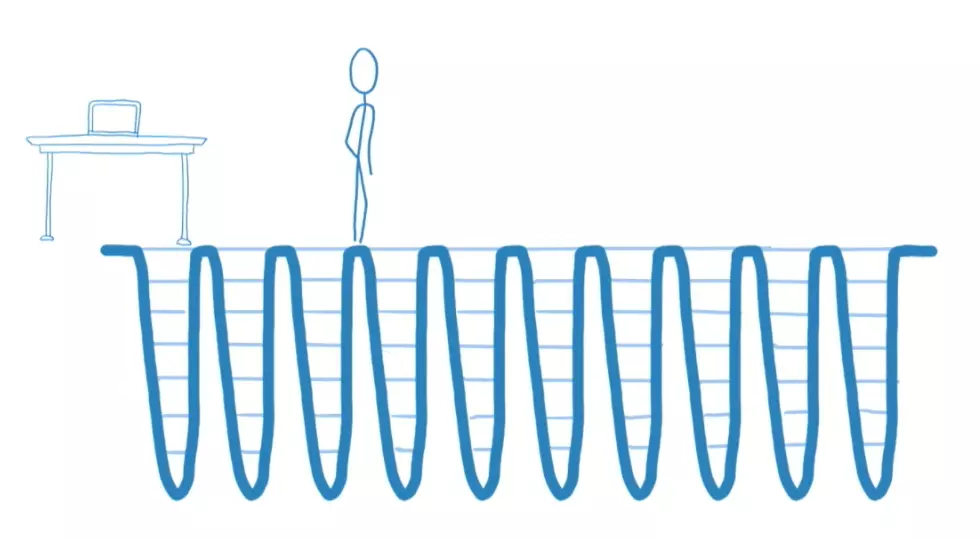
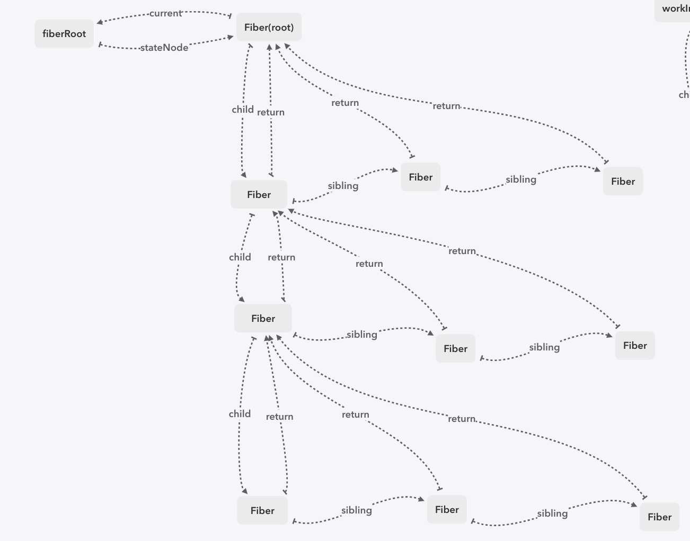

# 源码解析三 Fiber and FiberRoot
Fiber 出来之后，新的调和系统称为 fiber reconciler，为了识别，我们把老的调和系统称为 stack reconciler。 每一个 ReactElement，都会生成相应的工作单元（这里我们把每个工作单元称为 Fiber），根据这些节点的层级关系，会生成整个 Fiber树，我们的一切调和过程，都是围绕 Fiber树展开的

## stack reconciler 和 fiber reconciler
在 stack reconciler中，整个 VDOM树 如下图：



如果某个节点 setState，会从当前节点开始，一直递归到整个dom树的最底层。找到需要修改的信息，并传递给 renderer 进行渲染，这整个过程是一气呵成，连续不可中断的，如果需要渲染的组件比较庞大，js执行占据主线程时间较长，导致页面响应度变差，就会很明显造成卡顿现象，整个过程类似下图：



为了解决这个问题，React 重构了整个调和架构，称为新的 fiber reconciler，它支持：
1. 对每个任务划分优先级，根据优先级不同区别处理
1. 能够把可中断的任务切片处理
2. 能够调整优先级，重置并复用任务
3. 能够在父元素与子元素之间交错处理，以支持 React 中的布局
整个过程类似下图：



以上的3点都要求整个调度的过程可拆分，可中断。新的 Fiber树如下图



将整个树结构用链表来实现，每个节点都记录了跟它有关的关系信息，有了关系信息，就可以很轻易的通过某一个节点，复现整个树。自然满足了可拆分，可中断

## FiberRoot
FiberRoot 是整个 Fiber树的根节点，所以 FiberRoot 上记录着整个 Fiber树的调度信息

``` javaScript
class FiberRoot {
  containerInfo: Element  // 容器节点
  current: Fiber // 当前根节点的 fiber

  // 最老和最新的被挂起的任务的优先级
  earliestSuspendedTime: ExpirationTime = NoWork
  latestSuspendedTime: ExpirationTime = NoWork

  // 最老和最新的不确定是否挂起的任务的优先级
  earliestPendingTime: ExpirationTime = NoWork
  latestPendingTime: ExpirationTime = NoWork

  // 最新的通过一个promise被reslove并且可以重新尝试的优先级
  latestPingedTime: ExpirationTime = NoWork

  didError: boolean = false

  // 等待提交的优先级
  pendingCommitExpirationTime: ExpirationTime = NoWork

  // 完成render后的 fiber 树
  finishedWork: Fiber = null

  // 挂起任务的timeout 标志位
  timeoutHandle: number = noTimeout

  // 下一个 work 的优先级与当前优先级
  nextExpirationTimeToWorkOn: ExpirationTime = NoWork
  expirationTime: ExpirationTime = NoWork

  firstBatch: Batch = null

  nextScheduledRoot: FiberRoot = null

  constructor(containerInfo: Element, isConcurrent: boolean) {
    const mode = isConcurrent ? ConcurrentMode : NoContext // 区分异步还是同步

    this.current = new Fiber(HostRoot, null, null, mode)
    this.containerInfo = containerInfo
    this.current.stateNode = this
  }
}
```

## Fiber
Fiber 是一个工作单元，由于一切的调度更新渲染都是围绕着它展开，在 fiber reconciler 下，操作是可以分成很多小部分，并且可以被中断的，所以同步操作DOM可能会导致 Fiber树与实际DOM的不同步。对于每个节点，不光需要存储了对应元素节点的基本信息，还要保存一些用于任务调度的信息，以及跟周围节点的关系信息

``` javaScript
class Fiber {
  // 组件类型 如：function、class、hostComponent 等
  tag: WorkTag
  // ReactElment 里的 key
  key: null | string
  // ReactElement.type，也就是我们调用`createElement`的第一个参数
  elementType: any = null
  // 异步组件resolved之后返回的内容，一般是`function`或者`class`
  type: any = null
  // 自身特性，如：class就是当前 的组件对象，hostComponent 就是 dom 元素
  stateNode: any = null

  return: Fiber = null // 父节点
  child: Fiber = null // 子节点
  sibling: Fiber = null // 右边的兄弟节点
  index: number = 0 // 索引值

  ref: any = null

  pendingProps: any // 未处理的 props,可以理解为 new props
  memoizedProps: any = null // 当前节点的 props,可以理解为 old props

  updateQueue: UpdateQueue<any> = null // 当前节点的任务队列
  memoizedState: any = null // 当前节点的state

  contextDependencies: ContextDependencyList = null // context 列表

  mode: TypeOfMode // 工作类型， NoContext：同步渲染 ConcurrentMode：异步渲染

  effectTag: SideEffectTag = NoEffect // 标记当前节点的一些效果

  nextEffect: Fiber = null
  firstEffect: Fiber = null
  lastEffect: Fiber = null

  expirationTime: ExpirationTime = NoWork // 优先级
  childExpirationTime: ExpirationTime = NoWork // 子优先级

  alternate: Fiber = null // 用于调度时的快照

  constructor(tag: WorkTag, pendingProps: any, key: string | null, mode: TypeOfMode) {
    this.tag = tag
    this.pendingProps = pendingProps
    this.key = key
    this.mode = mode
  }
}
```