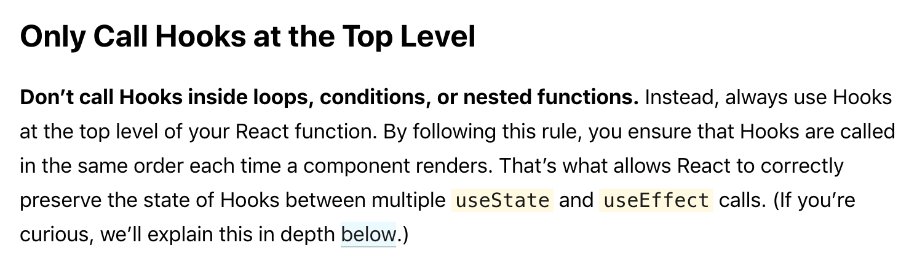

# `hook`的结构与本质

`React`在 16.8 中更新了`Hook`，支持在 `Function Component`中加入状态，以及一种全新的复用逻辑的方式。这里不细细阐述它的用法，直戳它的实现本质

无论使用哪种方式创建组件，在`react`中都会转化为`fiber`节点，每个`fiber`都有其`state`属性和`updateQueue`属性，用来管理自身状态以及更新队列。在之前，`function Component`又被称为无状态组件，顾名思义，它的`state`和`updateQueue`属性都是为`null`，而`hook`的实现，就与这两个属性有关

以下是整个结构图


### `hook`的结构

为了让`function`能让`class`那样`setState()`操控自身的状态，必然需要`state`和`updateQueue`这两个属性，这个可以充分利用`fiber`自身的`memoizedState`和`updateQueue`来实现。但是，这会带来一个问题，`state`和`fiber`高度耦合，相互关联，如果要复用某套关于某个状态的逻辑，必然会把跟其相关的`fiber`牵扯进来，这必然会导致冗余。类似的实现如`hoc`和`render props`，都会创建一个无用的`fiber`。复用逻辑的成本很大

所以，在`hook`的设计中，每个`hook`代表一个独立的状态单元，拥有其`state`和`updateQueue`，可以随意塞入到任何的`fiber`中，相互之间没有联系，复用时只需要引入相应的`hook`就好

```javaScript
interface Update<S, A> {
  expirationTime: ExpirationTime,
  action: A,
  eagerReducer: ((s: S, a: A) => S),
  eagerState: S,
  next: Update<S, A>,
}

interface UpdateQueue<S, A> {
  last: Update<S, A>, // update的环形链表
  dispatch: ((a: A) => any),
  eagerReducer: ((s: S, a: A) => S), // 记录当前的reducer，在dispatch时用于提前计算state
  eagerState: S, // 计算当前的state，在dispath中做为提前计算的基值
}

interface Hook {
  memoizedState: any, // 当前的state
  baseState: any, // 记录低优先级的第一个跳过的state
  baseUpdate: Update<any, any>, // 记录低优先级的第一个跳过的update
  queue: UpdateQueue<any, any>, // 更新队列
  next: Hook,
}
```

由于`react`的更新需要拿到之前的`state`进行对比，从而可以选择性的进行优化（如 `shouldComponentUpdate`）。显然，老的`state`也需要从`fiber`中获取，这又回到了我们上面提到的问题，导致`fiber`与`hook`强绑定在一起。而现在，由于`hook`就是一个独立的状态单元，所以，可以从`hook`获取到之前的`状态信息`。但是，这又会引发一个问题，如何保证我们现在拿`oldState`的`hook`与之前创建的`hook`是同一个呢？

因此，`react`采用了一种全新的思路，将`hook`设计成链表型的队列，在`function Component`初始化时，生成调用到的相应`hook`，并将其插入到`hook`队列末尾，调用结束后，将整个队列塞到`fiber`的`memoizedState`上。在`update`时，会重新执行`function`，此时我们直接从`memoizedState`取出之前的队列，在调用到`hook`时，从队列头中取出相应的`hook`，对其上的状态进行对比以及处理更新。只要每次在调用`function`时其内部`hook`的执行顺序是相同的，那么我们的新老对比就是完全可行的，所以这也`hook`能否正确使用最重要的一环，为此，`react`官方明确指出了`hook`的规则

