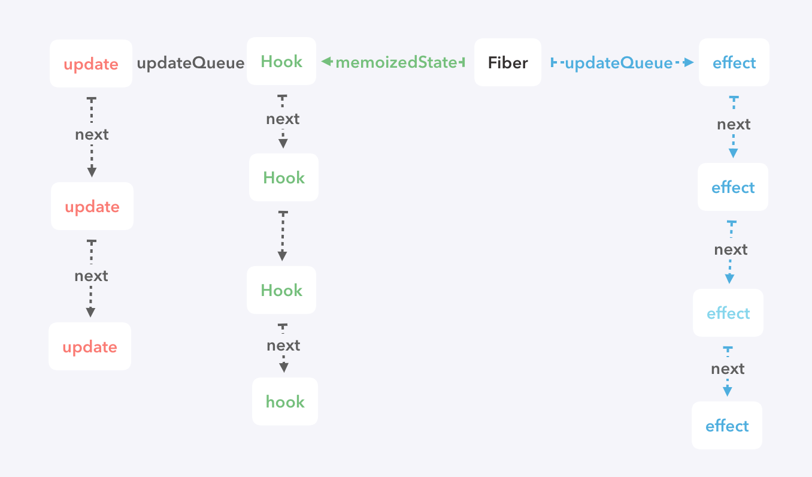

# `Hook`

`React`在 16.8 中更新了`Hook`，支持在 `Function Component`中加入状态，以及一种全新的复用逻辑的方式。这里不细细阐述它的用法，直戳它的实现本质

无论使用哪种方式创建组件，在`react`中都会转化为`fiber`节点，每个`fiber`都有其`state`属性和`updateQueue`属性，用来管理自身状态跟更新队列。在之前，`function Component`又被称为无状态组件，顾名思义，它的`state`和`updateQueue`属性都是为`null`，而`hook`的实现，就与这两个属性息息相关

以下是整个结构图

### `Hook`的结构