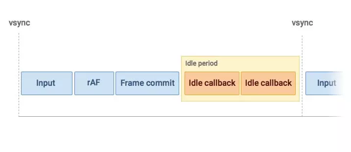
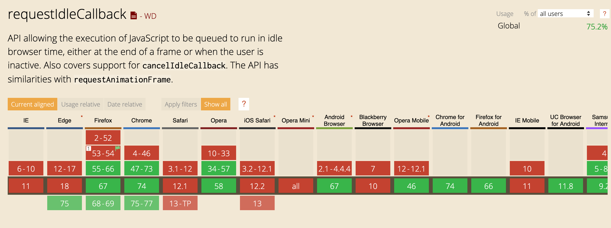

# 源码解析十六 `requestIdleCallback`的`polyfill`

整个`Fiber`的异步，可中断都依赖于`expirationTime`，那么整个`render`阶段如果被中断了，异步又是如何调用呢，是否可中断又是如何判断的？

这一切都跟`requestIdleCallback`这个`API`有关，该函数接受一个回调，只在浏览器的空闲时间才会调用。这样子就可以把任务分开，按照优先级高低，高优先级的先执行，低优先级的等有空闲时间在执行，如果浏览器一直处于繁忙状态，也会触发回调。此时这个函数会给回调一个参数，告诉当前执行时是否已经超时，我们可以根据这个参数来判断是否可中断。另外，从图上可以看出，回调每次被调用时页面已经渲染完毕



### `requestIdleCallback`的问题
原生的`requestIdleCallback`有两个重要的问题，首先，它的兼容性很差，`IOS`上全军覆没



更致命的是，`requestIdleCallback`1秒只能调用20次，频次太低，这个完全满足不了`react`的要求，所以，需要自己实现了一个高频的`requestIdleCallback polyfill`

梳理一下要`polyfill`满足的需求：
1. 要满足每次在渲染后能尽可能快的触发回调
2. 调用时可以区分是否是空闲时间

为了实现它，我们的思路是：
1. 每次渲染前调用一个函数，在函数里计算帧过期时间，然后给任务队列增加一个`marcoTask`
2. 渲染后会进入下一个事件循环，执行渲染前增加的`marcoTask`，拿当前时间与帧过期时间作比较，即可知道当前的任务是否空闲

综上，渲染前我们采用了`requestAnimationFrame`，首先，它的精确度很高，而且每次渲染前都会触发，但是它也有个缺点，如果页面处于后台时，回调不会执行，为了兼容各种情况，先封装了个满足各种情况的`requestAnimationFrameWithTimeout`

```javaScript
const ANIMATION_FRAME_TIMEOUT = 100
let raFID: number = -1
let rAFTimeoutID: any = -1

function requestAnimationFrameWithTimeout(callback: Function) {
  raFID = requestAnimationFrame((timestamp) => {
    clearTimeout(rAFTimeoutID)
    callback(timestamp)
  })

  rAFTimeoutID = setTimeout(() => {
    cancelAnimationFrame(raFID)
    callback(now())
  }, ANIMATION_FRAME_TIMEOUT)
}
```

我们在`requestAnimationFrameWithTimeout`的回调中，计算出当前帧的过期时间

那么，如何计算当前帧的过期时间呢？`react`采用了一种非常巧妙的办法，根据`requestAnimationFrame`的执行频率，渐进式地调整，计算出当前设备每帧的时间，那么 过期时间 = 当前时间 + 每帧的时间 

```javaScript
let frameDeadline: number = 0  // 从30fps（即30帧）开始调整得到的更适于当前环境的一帧限制时间
let previousFrameTime: number = 33
let activeFrameTime: number = 33 // 30fps为参考值

function animationTick(rafTime: number) {
  ...

  // 自发地调整使activeFrameTime约为当前设备的帧时间，便于计算帧过期时间
  let nextFrameTime = rafTime - frameDeadline + activeFrameTime
  if (nextFrameTime < activeFrameTime && previousFrameTime < activeFrameTime) {
    // 最小不能小于8ms，也频率就是120hz
    if (nextFrameTime < 8) {
      nextFrameTime = 8
    }
    activeFrameTime = nextFrameTime < previousFrameTime ? previousFrameTime : nextFrameTime
  } else {
    previousFrameTime = nextFrameTime
  }
  frameDeadline = rafTime + activeFrameTime

  ...
}
```

另外，我们要触发一个`macroTask`，这个`marcoTask`在所有`marcoTask`中优先级应该尽可能靠前，然后，它的兼容性要好，为了满足这些，`react`官方使用了`MessageChannel`

```javaScript
const channel = new MessageChannel()
const port = channel.port2
```

再看一下整个`polyfill`，对外开放的是一个启动和取消的函数，还有一个判断是否过期的工具函数：

```javaScript
let scheduledHostCallback: Function = null
let timeoutTime: number = -1

let isMessageEventScheduled: boolean = false
let isAnimationFrameScheduled: boolean = false
let isFlushingHostCallback: boolean = false

function requestHostCallback(callback: Function, absoluteTimeout: number) {
  scheduledHostCallback = callback
  timeoutTime = absoluteTimeout

  // 不等待下一帧，尽快执行
  if (isFlushingHostCallback || absoluteTimeout < 0) {
    port.postMessage(undefined)
  } else if (!isAnimationFrameScheduled) {
    isAnimationFrameScheduled = true
    requestAnimationFrameWithTimeout(animationTick)
  }
}

function cancelHostCallback() {
  scheduledHostCallback = null
  timeoutTime = -1
  isMessageEventScheduled = false
}

function shouldYieldToHost() {
  return frameDeadline <= now()
}
```

完整版的`animationTick`如下：

```javaScript
function animationTick(rafTime: number) {
  if (scheduledHostCallback !== null) {
    requestAnimationFrameWithTimeout(animationTick)
  } else {
    isAnimationFrameScheduled = false
    return
  }

  // 自发地调整使activeFrameTime约为当前设备的帧时间，便于计算帧过期时间
  let nextFrameTime = rafTime - frameDeadline + activeFrameTime
  if (nextFrameTime < activeFrameTime && previousFrameTime < activeFrameTime) {
    // 最小不能小于8ms，也频率就是120hz
    if (nextFrameTime < 8) {
      nextFrameTime = 8
    }
    activeFrameTime = nextFrameTime < previousFrameTime ? previousFrameTime : nextFrameTime
  } else {
    previousFrameTime = nextFrameTime
  }
  frameDeadline = rafTime + activeFrameTime
  if (!isMessageEventScheduled) {
    isMessageEventScheduled = true
    port.postMessage(undefined)
  }
}
```

跟我们说的一样，先获取过期时间，然后，调用`port.postMessage(undefined)`触发一个`macroTask`

最后，我们看看渲染后的回调，先判断是否有空闲时间，如果有，则判断任务是否超时，超时的话打上标记位，继续执行任务，未超时的话则丢给下一帧再执行

```javaScript
channel.port1.onmessage = (_event) => {
  isMessageEventScheduled = false

  const prevScheduledCallback = scheduledHostCallback
  const prevTimeoutTime = timeoutTime
  scheduledHostCallback = null
  timeoutTime = -1

  const currentTime = now()

  let didTimeout: boolean = false

  // 是否是空闲任务
  if (frameDeadline - currentTime <= 0) {
    // 当前任务是否超时
    if (prevTimeoutTime !== -1 && prevTimeoutTime <= currentTime) {
      // 超时
      didTimeout = true
    } else {
      // 没有超时，重新起animation frame
      if (!isAnimationFrameScheduled) {
        isAnimationFrameScheduled = true
        requestAnimationFrameWithTimeout(animationTick)
      }
      scheduledHostCallback = prevScheduledCallback
      timeoutTime = prevTimeoutTime
      return
    }
  }

  if (prevScheduledCallback !== null) {
    isFlushingHostCallback = true
    try {
      prevScheduledCallback(didTimeout)
    } finally {
      isFlushingHostCallback = false
    }
  }
}
```


