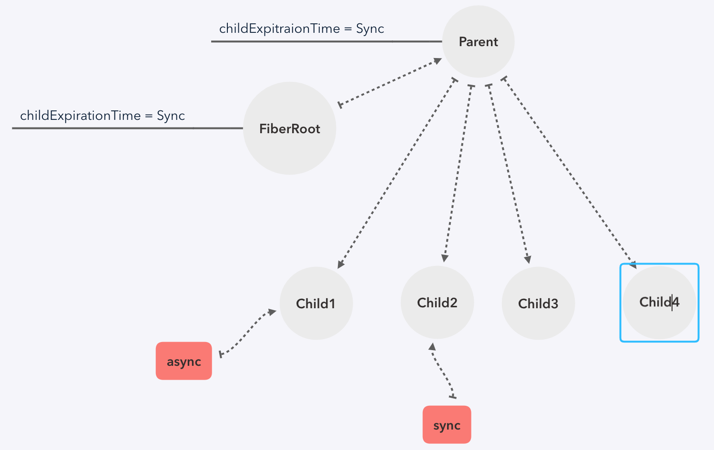

# 源码解析七  `schedule`调度前准备

在`schedule`里维护着一条`FiberRoot`的双向链表，FibreRoot就相当于调度时的基本工作单元，所以在准备阶段：
- 先初始化`schedule`一些关键性的全局变量
- 通过当前节点拿到这次更新的`FiberRoot`，更新它的优先级，并塞进双向链表中
- 发起一个正确的任务调度请求：

先上源码：

``` javaScript
// render 阶段的三个指针
let nextRoot: FiberRoot = null
let nextUnitOfWork: Fiber = null
let nextRenderExpirationTime: ExpirationTime = NoWork

function scheduleWork(fiber: Fiber, expirationTime: ExpirationTime) {
  const root: FiberRoot = scheduleWorkToRoot(fiber, expirationTime)

  // render 阶段的一些全局变量 init
  if (!isWorking && nextRenderExpirationTime !== NoWork && expirationTime > nextRenderExpirationTime) {
    resetStack()
  }

 // 更新它的优先级
  markPendingPriorityLevel(root, expirationTime)

  if (!isWorking || isCommitting || nextRoot !== root) {
    const rootExpirationTime = root.expirationTime
    requestWork(root, rootExpirationTime)
  }

  if (nestedUpdateCount > NESTED_UPDATE_LIMIT) {
    nestedUpdateCount = 0
  }
}
```

### `scheduleWorkToRoot(fiber, expirationTime)`
再看这个函数之前，先解释下`fiber`里两个优先级`expirationTime`和`childExpirationTime`的区别：

- `expirationTime`：当前`fiber`自身的优先级，影响它自身更新
- `childExpirationTime`：当前`fiber`子节点的优先级，影响它子节点的更新

由于`childExpirationTime`涉及到当前节点跟它的子节点，所以特性也分为两种
- 若同一个子节点连续更新多次，取当前最高优先级那次的值
- 若N个不同子节点更新，也取优先级最高那次的值

举个例子：
如图，当`Child1`发起一个优先级较低的异步更新，`Child2`发起一个优先级最高的同步更新，再向上遍历时，因为这个更新是它们的子孙节点造成的，所以遍历的上层节点都会更新它的`childExpirationTime`。
在这个例子中，`Parent`和`FiberRoot`的`childExpirationTime`都会更新为`Sync`，当我们真正执行更新向下遍历时，会比较子节点的`expirationTime`与当前节点的`childExpirationTime`，这里`Child1`的`expirationTime`小于`Parent`的`childExpirationTime`，所以跳过它，直接到`Child2`，比较之后发现2需要更新，所以先执行2：



再看这个方法就很简单了，更新发起任务的`fiber`的优先级，然后往上遍历，每个上级的节点都更新其`childExpirationTime`，最后返回`FiberRoot`，源码如下，
``` javaScript
function scheduleWorkToRoot(fiber: Fiber, expirationTime: ExpirationTime): FiberRoot {
  let alternate: Fiber = fiber.alternate

  // 更新自身及副本的优先级
  if (fiber.expirationTime < expirationTime) {
    fiber.expirationTime = expirationTime
  }
  if (alternate !== null && alternate.expirationTime < expirationTime) {
    alternate.expirationTime = expirationTime
  }

  let node: Fiber = fiber.return
  let root: FiberRoot = null

  if (node === null && fiber.tag === HostRoot) {
    root = fiber.stateNode
  } else {
    while (node !== null) {
      ({ alternate } = node)

      if (node.childExpirationTime < expirationTime) {
        node.childExpirationTime = expirationTime
      }

      if (alternate !== null && alternate.childExpirationTime < expirationTime) {
        alternate.childExpirationTime = expirationTime
      }

      if (node.return === null && node.tag === HostRoot) {
        root = node.stateNode
        break
      }

      node = node.return
    }
  }
  return root
}
```

### `requestWork()`
如果现在不在`render阶段`，则会调用`requestWork`,将`fiberRoot`插入到双向链表中，，然后根据这个任务的优先级，进入`work`阶段，源码如下

```javaScript
function requestWork(root: FiberRoot, expirationTime: ExpirationTime) {
  addRootToSchedule(root, expirationTime)
  if (isRendering) {
    return
  }

 // 事件的 flag，setState异步性的原因
  if (isBatchingUpdates) {
    if (isUnbatchingUpdates) {
      nextFlushedRoot = root
      nextFlushedExpirationTime = Sync
      performWorkOnRoot(root, Sync, false)
    }
    return
  }

  if (expirationTime === Sync) {
    performSyncWork() // 同步
  } else {
    scheduleCallbackWithExpirationTime(expirationTime) // 异步
  }
}

// 将当前 FiberRoot 加到 scheduleRoot 链表中
// 如果已在链表中，更新 expirationTime
function addRootToSchedule(root: FiberRoot, expirationTime: ExpirationTime) {
  if (root.nextScheduledRoot === null) {
    root.expirationTime = expirationTime

    if (lastScheduledRoot === null) {
      firstScheduledRoot = lastScheduledRoot = root
      root.nextScheduledRoot = root
    } else {
      lastScheduledRoot.nextScheduledRoot = root
      lastScheduledRoot = root
      root.nextScheduledRoot = firstScheduledRoot
    }
  } else {
    const remainingExpirationTime = root.expirationTime
    if (expirationTime > remainingExpirationTime) {
      root.expirationTime = expirationTime
    }
  }
}
```


