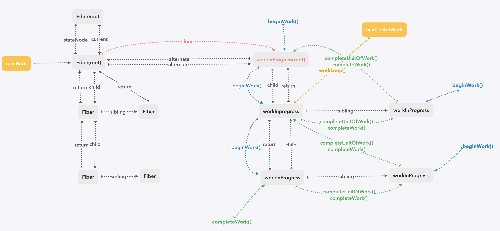

# 源码解析九  `render`阶段
整个`render`阶段，就是通过当前的`Fiber树`（以下统称`current`树）遍历生成一棵`workInProgress树`的过程，然后再将这整棵新树挂在`FiberRoot`的`finishWork`上
在遍历的过程中，会对每个节点进行调和，更新它自身的属性以及子节点，并打上更新标记

### `renderRoot()`
这个方法是整个`render`阶段的入口，先上源码：

```javaScript
// render阶段的三个指针
let nextRoot: FiberRoot = null
let nextUnitOfWork: Fiber = null
let nextRenderExpirationTime: ExpirationTime = NoWork

function renderRoot(root: FiberRoot, isYieldy: boolean) {
  // useEffect的调用
  flushPassiveEffects()

  isWorking = true

  // 清空对 hook 的引用
  const previousDispatcher = ReactCurrentDispatcher.current
  ReactCurrentDispatcher.current = HooksDispatcherOnEmpty

  const expirationTime = root.nextExpirationTimeToWorkOn

  // 上一个任务因为时间片用完了而中断了，这个时候 nextUnitOfWork 是有工作的，
  // 到了下一个时间切片，中途没有新的任务进来，那么这些全局变量都没有变过
  // 而如果有新的更新进来，则势必 nextExpirationTimeToWorkOn 或者 root 会变化，那么肯定需要重置变量，并从头开始
  if (expirationTime !== nextRenderExpirationTime || root !== nextRoot || nextUnitOfWork === null) {
    resetStack()

    nextRoot = root
    nextRenderExpirationTime = expirationTime
    nextUnitOfWork = createWorkInProgress(nextRoot.current, null)
    root.pendingCommitExpirationTime = NoWork
  }

  let didFatal: boolean = false

  do {
    try {
      workLoop(isYieldy)
    } catch (thrownValue) {
      console.error(thrownValue)

      resetContextDependences()
      resetHooks()

      if (nextUnitOfWork === null) {
        // 不可预期的错误
        didFatal = true
        onUncaughtError(thrownValue)
      } else {
        const sourceFiber = nextUnitOfWork
        const returnFiber = sourceFiber.return

        if (returnFiber === null) {
          didFatal = true
          onUncaughtError(thrownValue)
        } else {
          throwException(root, returnFiber, sourceFiber, thrownValue, nextRenderExpirationTime) // 错误处理，没完成
          nextUnitOfWork = completeUnitOfWork(sourceFiber)
          continue
        }
      }
    }
    break
  } while (true)

  isWorking = false
  ReactCurrentDispatcher.current = previousDispatcher
  resetContextDependences()
  resetHooks()

  if (didFatal) {
    nextRoot = null
    root.finishedWork = null
    return
  }

  // 如果中途被打断，并没有生成一棵完整的workInProgress树，所以要把root.finishWork清掉
  if (nextUnitOfWork !== null) {
    root.finishedWork = null
    return
  }

  nextRoot = null

  if (nextRenderDidError) {
    // 错误处理
  }

  root.pendingCommitExpirationTime = expirationTime
  root.finishedWork = root.current.alternate
}
```
在这个方法里，会通过`createWorkInProgress()`克隆一个新节点，然后让`nextUnitOfWork`指向这个节点，另外还有两个指针`nextRoot`和`nextRenderExpirationTime`，保存着当前render阶段的几个重要信息。


如果时间片不够中断了，又没有新的任务进来，下个时间切片的时候还是同样的任务，这时就可以通过这三个指针，快速定位到上次的工作点，立即开始。反之，如果被新的任务打断了，那么就必须从根节点重新遍历了

### `workLoop()`和`performUnitOfWork()`

``` javaScript
function workLoop(isYieldy: boolean) {
  if (isYieldy) {
    while (nextUnitOfWork !== null && !shouldYield()) {
      nextUnitOfWork = performUnitOfWork(nextUnitOfWork)
    }
  } else {
    while (nextUnitOfWork !== null) {
      nextUnitOfWork = performUnitOfWork(nextUnitOfWork)
    }
  }
}

function performUnitOfWork(workInProgress: Fiber): Fiber {
  const current = workInProgress.alternate

  let next: Fiber = null

  // 返回它的子节点
  next = beginWork(current, workInProgress, nextRenderExpirationTime)
  workInProgress.memoizedProps = workInProgress.pendingProps

  if (next === null) {
    // 返回它的兄弟节点
    next = completeUnitOfWork(workInProgress)
  }

  return next
}
```

在`workLoop`中，会调用`performUnitOfWork()`，通过`beginWork`和`completeUnitOfWork`两个函数，保证每个节点都会进入`beginWork()`和`completeWork()`
每次生成新的`workInProgress`都会返回到`workLoop`，更新`nextUnitOfWork`的指向，如果`nextUnitOfWork === null`，说明整棵`workInProgress`树都已经生成，可以进入`commit`阶段，异步时会追加一个`shouldYield`的判断，如果时间不够用，则停止整个树的遍历，结束掉render阶段




