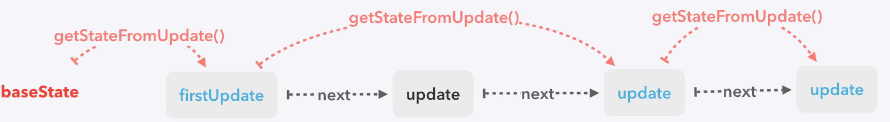

# 源码解析十一 `updateClassComponent`
`updateFunctionComponent`牵涉到`hook`，我们后面放在`hook`的时候说。这里重点讲下`updateClassComponent`
首先拿到最新的props,然后调用`updateFunctionComponent`

```javaScript
   case ClassComponent: {
      const Component = workInProgress.type
      // defaultProps的处理
      const unresolveProps = workInProgress.pendingProps
      const resolvedProps = workInProgress.elementType === Component ? unresolveProps : resolveDefaultProps(Component, unresolveProps)
      return updateClassComponent(current, workInProgress, Component, resolvedProps, renderExpirationTime)
    }
```

进入正篇，`classComponent`的实例都挂在`fiber`的`stateNode`上，如果没有`instance`上，说明是初次渲染，需要通过`constructClassInstance`初始化实例，然后，根据三种不同的情况，调用不同的函数：
- `mountClassInstance(workInProgress, Component, nextProps, renderExpirationTime)`
- `resumeMountClassInstance(workInProgress, Component, nextProps, renderExpirationTime)`
- `updateClassInstance(current, workInProgress, Component, nextProps, renderExpirationTime)`

这三个函数的功能大同小意，无非做了：
- 更新实例的`props`和`state`
- 调用生命周期
- 更新`context`
- 挂上`effectTag`

```javaScript
function updateClassComponent(current: Fiber, workInProgress: Fiber, Component: any, nextProps: any, renderExpirationTime: ExpirationTime): Fiber {
  // 处理context
  prepareToReadContext(workInProgress, renderExpirationTime)

  const instance = workInProgress.stateNode
  let shouldUpdate: boolean = false


  if (instance === null) {
    // suspend情况下，可以忽略
    if (current !== null) {
      current.alternate = null
      workInProgress.alternate = null
      workInProgress.effectTag |= Placement
    }

    constructClassInstance(workInProgress, Component, nextProps)
    mountClassInstance(workInProgress, Component, nextProps, renderExpirationTime)
    shouldUpdate = true

  } else if (current === null) {
    shouldUpdate = resumeMountClassInstance(workInProgress, Component, nextProps, renderExpirationTime)
  } else {
    shouldUpdate = updateClassInstance(current, workInProgress, Component, nextProps, renderExpirationTime)
  }

  const nextUnitWork = finishClassComponent(current, workInProgress, Component, shouldUpdate, renderExpirationTime)
  return nextUnitWork
}
```

### `constructClassInstance()`
```javaScript
function constructClassInstance(workInProgress: Fiber, ctor: any, props: any): any {
  let context: any = null
  const { contextType } = ctor

  // context操作
  if (isObject(contextType)) {
    context = readContext(contextType)
  }

  const instance = new ctor(props, context)
  workInProgress.memoizedState = isEmpty(instance.state) ? null : instance.state
  addOptionClassInstace(workInProgress, instance)

  return instance
}

function addOptionClassInstace(workInProgress: Fiber, instance: Component) {
  instance.updater = classComponentUpdater
  workInProgress.stateNode = instance

  instance._reactInternalFiber = workInProgress
}

const classComponentUpdater: ReactUpdateQueue = {
  isMounted,
  enqueueSetState(inst: Component, payload: any, callback: Function) {
    const fiber = inst._reactInternalFiber
    const currentTime = requestCurrentTime()
    const expirationTime = computeExpirationTimeForFiber(currentTime, fiber)
    const update = new Update(expirationTime, UpdateState, payload, callback)


    flushPassiveEffects()
    enqueueUpdate(fiber, update)
    scheduleWork(fiber, expirationTime)
  },

  enqueueReplaceState(inst: Component, payload: any, callback: Function) {
    const fiber = inst._reactInternalFiber
    const currentTime = requestCurrentTime()
    const expirationTime = computeExpirationTimeForFiber(currentTime, fiber)
    const update = new Update(expirationTime, ReplaceState, payload, callback)

    flushPassiveEffects()
    enqueueUpdate(fiber, update)
    scheduleWork(fiber, expirationTime)
  },

  enqueueForceUpdate(inst: Component, callback: Function) {
    const fiber = inst._reactInternalFiber
    const currentTime = requestCurrentTime()
    const expirationTime = computeExpirationTimeForFiber(currentTime, fiber)
    const update = new Update(expirationTime, ForceUpdate, null, callback)


    flushPassiveEffects()
    enqueueUpdate(fiber, update)
    scheduleWork(fiber, expirationTime)
  },
}
```

### `enqueueUpdate()`
整个初始化过程非常的简单，关键在于`instance.updater = classComponentUpdater`，还记的前面`Component`基类里的`setState`函数吗？就是调用了`updater.enqueueSetState`，`enqueueSetState`里的内容也跟前面我们总结的发起任务请求三步骤相同，这里我们解析下`enqueueUpdate`这个函数，以及更新队列的一些源码：

先看下更新队列的结构以及单个更新对象的结构，在`updateQueue`中，维护着三条有关`update`的单向链表，每个`update`里有着单次更新的全部信息，拿`update`举例：

```javaScript
             next           next           next
firstUpdate ------> update ------> update ------> lastUpdate
```

```javaScript
export class UpdateQueue<State> {
  // 记录上一次更新后低优先级的first state,用于调用的基值
  baseState: State

  // 更新对象链表
  firstUpdate: Update<State> = null
  lastUpdate: Update<State> = null

  // 捕获错误的更新对象链表
  firstCapturedUpdate: Update<State> = null
  lastCapturedUpdate: Update<State> = null

  // 有callback的更新对象链表，用于commit callback
  firstEffect: Update<State> = null
  lastEffect: Update<State> = null

  // 同上，捕获错误版
  firstCapturedEffect: Update<State> = null
  lastCapturedEffect: Update<State> = null

  constructor(baseState: State) {
    this.baseState = baseState
  }
}

export default class Update<State> {
  expirationTime: ExpirationTime

  tag: UpdateTag
  payload: any = null
  callback: Function = null

  next: Update<State> = null
  nextEffect: Update<State> = null

  constructor(expirationTime: ExpirationTime, tag: UpdateTag, payload?: any, callback?: Function) {
    this.expirationTime = expirationTime
    this.tag = tag

    if (payload) {
      this.payload = payload
    }

    if (!isEmpty(callback)) {
      this.callback = callback
    }
  }
}
```

再看`enqueueUpdate()`，首先确保`fiber`以及`alternate`都有自己的`updateQueue`，然后将`update`插入到两个`updateQueue`中

```javaScript
function cloneUpdateQueue<State>(queue: UpdateQueue<State>): UpdateQueue<State> {
  const updateQueue = new UpdateQueue<State>(queue.baseState)
  updateQueue.firstUpdate = queue.firstUpdate
  updateQueue.lastUpdate = queue.lastUpdate

  return updateQueue
}

function appendUpdateToQueue<State>(queue: UpdateQueue<State>, update: Update<State>) {
  if (queue.lastUpdate === null) {
    queue.firstUpdate = queue.lastUpdate = update
  } else {
    queue.lastUpdate.next = update
    queue.lastUpdate = update
  }
}

export function enqueueUpdate<State>(fiber: Fiber, update: Update<State>) {
  const { alternate } = fiber

  let queue1: UpdateQueue<State>
  let queue2: UpdateQueue<State>

  if (alternate === null) {
    queue1 = fiber.updateQueue
    queue2 = null

    if (queue1 === null) {
      queue1 = fiber.updateQueue = new UpdateQueue(fiber.memoizedState)
    }
  } else {
    queue1 = fiber.updateQueue
    queue2 = alternate.updateQueue

    if (queue1 === null && queue2 === null) {
      queue1 = fiber.updateQueue = new UpdateQueue(fiber.memoizedState)
      queue2 = alternate.updateQueue = new UpdateQueue(alternate.memoizedState)
    } else if (queue1 !== null && queue2 === null) {
      queue2 = alternate.updateQueue = cloneUpdateQueue(queue1)
    } else if (queue1 === null && queue2 !== null) {
      queue1 = fiber.updateQueue = cloneUpdateQueue(queue2)
    }
  }

  if (queue2 === null || queue1 === queue2) {
    appendUpdateToQueue(queue1, update)
  } else if (queue1.lastUpdate === null || queue2.lastUpdate === null) {
    appendUpdateToQueue(queue1, update)
    appendUpdateToQueue(queue2, update)
  } else {
    // 两个队列都不为空，它们的last update是相同的
    appendUpdateToQueue(queue1, update)
    queue2.lastUpdate = update
  }
}
```

### `processUpdateQueue()`
在`mountClassInstance()`和`updateClassInstance()`都会更新`state`，

```javaScript
const updateQueue = workInProgress.updateQueue
  if (updateQueue !== null) {
    processUpdateQueue(workInProgress, updateQueue, newProps, instance, renderExpirationTime)
    newState = workInProgress.memoizedState
}
```

`processUpdateQuque`会分别遍历`update`链表和`capturedUpdate`链表，将优先级高于当前传入优先级的`update`进行链式调用，将前一次获得的`state`传入，直到遍历完链表，获取到最新的`state`，如下图：



蓝字的是优先级较高，遍历完后更新`updatequeue`以及`workInProgress`的一些参数，再看代码：

```javaScript
export function getStateFromUpdate<State>(workInProgress: Fiber, update: Update<State>, prevState: State, nextProps: any, instance: any): any {
  switch (update.tag) {
    case ReplaceState: {
      const { payload } = update
      if (isFunction(payload)) {
        const nextState = payload.call(instance, prevState, nextProps)
        return nextState
      }
      return payload
    }
    case CaptureUpdate: {
      workInProgress.effectTag = (workInProgress.effectTag & ~ShouldCapture) | DidCapture
    }
    case UpdateState: {
      const { payload } = update
      let partialState: any

      if (isFunction(payload)) {
        partialState = payload.call(instance, prevState, nextProps)
      } else {
        partialState = payload
      }

      if (isEmpty(partialState)) {
        return prevState
      }

      return { ...prevState, ...partialState }
    }

    case ForceUpdate: {
      changeHasForceUpdate(true)
      return prevState
    }
  }

  return prevState
}

export function processUpdateQueue<State>(workInProgress: Fiber, queue: UpdateQueue<State>, props: any, instance: any, renderExpirationTime: ExpirationTime) {
  hasForceUpdate = false

  queue = ensureWorkInProcessQueueIsAClone(workInProgress, queue)

  let newBaseState: State = queue.baseState
  let newFirstUpdate: Update<State> = null
  let newExpirationTime: ExpirationTime = NoWork

  let update: Update<State> = queue.firstUpdate
  let resultState: State = newBaseState

  while (update !== null) {
    const updateExpirationTime = update.expirationTime

    // update 的优先级较低
    if (updateExpirationTime < renderExpirationTime) {
      // 更新新的 update 链表起点
      if (newFirstUpdate === null) {
        newFirstUpdate = update
        newBaseState = resultState
      }

      // 更新优先级
      if (newExpirationTime < updateExpirationTime) {
        newExpirationTime = updateExpirationTime
      }
    } else {
      // 获取 state
      resultState = getStateFromUpdate(workInProgress, update, resultState, props, instance)

      // callback的处理
      const { callback } = update
      if (callback !== null) {
        workInProgress.effectTag |= Callback

        update.nextEffect = null
        if (queue.lastEffect === null) {
          queue.firstEffect = queue.lastEffect = update
        } else {
          queue.lastEffect.nextEffect = update
          queue.lastEffect = update
        }
      }
    }
    update = update.next
  }

  let newFirstCapturedUpdate: Update<State> = null
  update = queue.firstCapturedUpdate

  while (update !== null) {
    const updateExpirationTime = update.expirationTime
    if (updateExpirationTime < renderExpirationTime) {
      if (newFirstCapturedUpdate === null) {
        newFirstCapturedUpdate = update
        if (newBaseState === null) {
          newBaseState = resultState
        }
      }

      if (newExpirationTime < updateExpirationTime) {
        newExpirationTime = updateExpirationTime
      }
    } else {
      resultState = getStateFromUpdate(workInProgress, update, resultState, props, instance)

      const { callback } = update
      if (callback !== null) {
        workInProgress.effectTag |= Callback

        update.nextEffect = null
        if (queue.lastCapturedEffect === null) {
          queue.lastCapturedEffect = queue.firstCapturedEffect = update
        } else {
          queue.lastCapturedEffect.nextEffect = update
          queue.lastCapturedEffect = update
        }
      }
    }
    update = update.next
  }

  if (newFirstUpdate === null) {
    queue.lastUpdate = null
  }

  if (newFirstCapturedUpdate === null) {
    queue.lastCapturedUpdate = null
  } else {
    workInProgress.effectTag |= Callback
  }

  if (newFirstUpdate === null && newFirstCapturedUpdate === null) {
    newBaseState = resultState
  }

  queue.baseState = newBaseState
  queue.firstUpdate = newFirstUpdate
  queue.firstCapturedUpdate = newFirstCapturedUpdate

  workInProgress.expirationTime = newExpirationTime
  workInProgress.memoizedState = resultState
}
```

### `mountClassInstance()`和`updateClassInstance()`
再看这两个函数，主要区别在于`updateClassInstance`里多了两个更新的判断

```javaScript
function mountClassInstance(workInProgress: Fiber, ctor: any, newProps: any, renderExpirationTime: ExpirationTime) {
  const { stateNode: instance, memoizedState } = workInProgress
  instance.props = newProps
  instance.state = memoizedState
  instance.refs = {}

  // context 操作
  const { contextType } = ctor
  if (isObject(contextType)) {
    instance.context = readContext(contextType)
  }

  // 更新 state
  let updateQueue: UpdateQueue<any> = workInProgress.updateQueue
  if (updateQueue !== null) {
    processUpdateQueue(workInProgress, updateQueue, newProps, instance, renderExpirationTime)
    instance.state = workInProgress.memoizedState
  }

  // 调用 getDerivedStateFromProps 生命周期
  const { getDerivedStateFromProps } = ctor
  if (isFunction(getDerivedStateFromProps)) {
    applyDerivedStateFromProps(workInProgress, getDerivedStateFromProps, newProps)
    instance.state = workInProgress.memoizedState
  }

  // 调用 componentWillMount 生命周期
  const haveNewLifecycle = isFunction(ctor.getDerivedStateFromProps) && isFunction(instance.getSnapshotBeforeUpdate)
  const haveComponentWillMount = isFunction(instance.UNSAFE_componentWillMount) && isFunction(instance.componentWillMount)
  if (!haveNewLifecycle && haveComponentWillMount) {
    applyComponentWillMount(instance)

    updateQueue = workInProgress.updateQueue
    if (updateQueue !== null) {
      processUpdateQueue(workInProgress, updateQueue, newProps, instance, renderExpirationTime)
      instance.state = workInProgress.memoizedState
    }
  }

  // 打上标记
  if (isFunction(instance.componentDidMount)) {
    workInProgress.effectTag |= UpdateTag
  }
}

function updateClassInstance(current: Fiber, workInProgress: Fiber, ctor: any, newProps: any, renderExpirationTime: ExpirationTime): boolean {
  const { stateNode: instance } = workInProgress

  const oldProps = workInProgress.memoizedProps
  instance.props = workInProgress.type === workInProgress.elementType ? oldProps : resolveDefaultProps(workInProgress.type, oldProps)

  // context处理
  const oldContext = instance.context
  const { contextType } = ctor
  let nextContext: any = null
  if (typeof contextType === 'object' && contextType !== null) {
    nextContext = readContext(contextType)
  }

  const { getDerivedStateFromProps } = ctor

  // componentWillReceiveProps 调用
  const haveNewLifecycles = isFunction(getDerivedStateFromProps) || isFunction(instance.getSnapshotBeforeUpdate)
  const havecomponentWillReceiveProps = isFunction(instance.UNSAFE_componentWillReceiveProps) || isFunction(instance.componentWillReceiveProps)
  if (!haveNewLifecycles && havecomponentWillReceiveProps) {
    if (oldProps !== newProps || oldContext !== nextContext) {
      applyComponentWillReceiveProps(instance, newProps, nextContext)
    }
  }

  changeHasForceUpdate(false)

  // 更新 state
  const oldState = workInProgress.memoizedState
  let newState: any = (instance.state = oldState)

  const updateQueue = workInProgress.updateQueue
  if (updateQueue !== null) {
    processUpdateQueue(workInProgress, updateQueue, newProps, instance, renderExpirationTime)
    newState = workInProgress.memoizedState
  }

  // 初始判断，是否需要更新
  if (oldProps === newProps && oldState === newState && !getHasForceUpdate()) {
    if (isFunction(instance.componentDidUpdate)) {
      if (oldProps !== current.memoizedProps || oldState !== current.memoizedState) {
        workInProgress.effectTag |= UpdateTag
      }
    }

    if (isFunction(instance.getSnapshotBeforeUpdate)) {
      if (oldProps !== current.memoizedProps || oldState !== current.memoizedState) {
        workInProgress.effectTag |= Snapshot
      }
    }
    return false
  }

  // getDerivedStateFromProps 调用
  if (isFunction(getDerivedStateFromProps)) {
    applyDerivedStateFromProps(workInProgress, getDerivedStateFromProps, newProps)
    newState = workInProgress.memoizedState
  }

  // 是否需要更新
  const shouldUpdate = getHasForceUpdate() || checkShouldComponentUpdate(instance, ctor, oldProps, newProps, oldState, newState, nextContext)

  if (shouldUpdate) {
    if (!haveNewLifecycles) {
      if (isFunction(instance.componentWillUpdate)) {
        instance.componentWillUpdate(newProps, newState, nextContext)
      }
      if (isFunction(instance.UNSAFE_componentWillUpdate)) {
        instance.UNSAFE_componentWillUpdate(newProps, newState, nextContext)
      }
    }

    if (isFunction(instance.componentDidUpdate)) {
      workInProgress.effectTag |= UpdateTag
    }
    if (isFunction(instance.getSnapshotBeforeUpdate)) {
      workInProgress.effectTag |= Snapshot
    }
  } else {
    if (isFunction(instance.componentDidUpdate)) {
      if (oldProps !== current.memoizedProps || oldState !== current.memoizedState) {
        workInProgress.effectTag |= UpdateTag
      }
    }
    if (isFunction(instance.getSnapshotBeforeUpdate)) {
      if (oldProps !== current.memoizedProps || oldState !== current.memoizedState) {
        workInProgress.effectTag |= Snapshot
      }
    }

    workInProgress.memoizedProps = newProps
    workInProgress.memoizedState = newState
  }

  instance.props = newProps
  instance.state = newState
  instance.context = nextContext

  return shouldUpdate
}
```

`updateClassInstance`里判断是否更新做了两层判断：
第一层很简单，判断新老`props`，`state`是否相等，如果相等的话就返回false
关键在于第二层，这里就是我们经常在代码里写的手动优化，`shouldComponentUpdate`和`pureComponent`

```javaScript
function checkShouldComponentUpdate(instance: any, ctor: any, oldProps: any, newProps: any, oldState: any, newState: any, newContext: any) {
  if (isFunction(instance.shouldComponentUpdate)) {
    const shouldUpdate = instance.shouldComponentUpdate(newProps, newState, newContext)
    return shouldUpdate
  }

  if (ctor.prototype && ctor.prototype.isPureReactComponent) {
    return (!shallowEqual(oldProps, newProps) || !shallowEqual(oldState, newState))
  }
  return true
}
```

有`shouldComponentUpdate`，那么是否更新取决于这个函数的返回值
`pureComponent`基类里比`Component`多一个`isPureReactComponent`，所以，若有这个标，则有一个默认的浅比较函数，返回浅比较的值

```javaScript
export function shallowEqual(objA: any, objB: any): boolean {
  if (Object.is(objA, objB)) {
    return true
  }

  if (typeof objA !== 'object' || objA === null || typeof objB !== 'object' || objB === null) {
    return false
  }

  const keysA = Object.keys(objA)
  const keysB = Object.keys(objB)

  if (keysA.length !== keysB.length) {
    return false
  }

  for (let i = 0; i < keysA.length; i++) {
    if (!Object.prototype.hasOwnProperty.call(objB, keysA[i]) || !Object.is(objA[keysA[i]], objB[keysA[i]])) {
      return false
    }
  }

  return true
}
```

### `finishClassComponent`
回到`updateClassComponent`，在经历上面初始化或者更新以后，现在实例上的state,props都已经是最新的了，生命周期也调了，是否需要更新的标也有了，OK，万事具备，只差`render`，这时调用`finishClassComponent`，不需要更新的话，直接返回`bailoutOnAlreadyFinishedWork`，这个函数前面在`beginWork`里已说过。再往下，调用了实例的`render`，生成新的子节点属性，然后通过这些新的子节点属性生成新的子`Fiber`

```javaScript
function finishClassComponent(current: Fiber, workInProgress: Fiber, Component: any, shouldUpdate: boolean, renderExpirationTime: ExpirationTime): Fiber {
  markRef(current, workInProgress)

  const didCaptureError = (workInProgress.effectTag & DidCapture) !== NoEffect

  if (!shouldUpdate && !didCaptureError) {
    return bailoutOnAlreadyFinishedWork(current, workInProgress, renderExpirationTime)
  }

  const { stateNode: instance } = workInProgress

  let nextChildren: any = null

  if (didCaptureError && !isFunction(Component.getDerivedStateFromError)) {
    nextChildren = null
  } else {
    nextChildren = instance.render()
  }

  workInProgress.effectTag |= PerformedWork
  if (current !== null && didCaptureError) { // 错误情况下不复用现有的children
    workInProgress.child = reconcileChildFibers(workInProgress, current.child, null, renderExpirationTime) // 删除当前存在的children
    workInProgress.child = reconcileChildFibers(workInProgress, null, nextChildren, renderExpirationTime) // 重新生成新的children
  } else {
    reconcileChildren(current, workInProgress, nextChildren, renderExpirationTime)
  }

  workInProgress.memoizedState = instance.state
  return workInProgress.child
}
```

这里大体把`classComponent`的调和过程过了一遍：
- 先更新自身的属性
- 拿到新的子节点属性，去生成新的`fiber`

另外，结合上面，在`schedule`的`render`阶段调用的`class`生命周期有：
- `componentWillMount`
- `static getDerivedStateFromProps`
- `componentWillReceiveProps`
- `componentWillUpdate`

前面提到过，在`render`阶段是可以被打断的，当执行完高优先级任务后，再回到这个任务，会从根节点重新开始，这时第一阶段的生命周期会被执行多次。如果这些函数有副作用的，可能会引发一些错误。
所以为了避免这样的情况，官方不提倡使用`componentWillMount`，`componentWillReceiveProps`，`componentWillUpdate`，并且增加了一个新的静态钩子函数`static getDerivedStateFromProps`，方便做一些改变state的操作，由于是`static`，拿不到`this`，从而避免了一些可能发生的错误


